# 10. Quality Scenarios

**General Purpose:** Evaluate system quality using concrete scenarios.

## 10.1 Quality Tree

**General Purpose:** Hierarchical breakdown of quality goals with priorities.

```mermaid
graph TB
    ROOT[EPC Quality Goals]
    
    ROOT --> REL[Reliability<br/>Priority: 1]
    ROOT --> MAINT[Maintainability<br/>Priority: 2]
    ROOT --> USE[Usability<br/>Priority: 3]
    ROOT --> SEC[Security<br/>Priority: 4]
    ROOT --> PERF[Performance<br/>Priority: 5]
    ROOT --> TEST[Testability<br/>Priority: 6]
    
    REL --> REL1[Data Integrity]
    REL --> REL2[Configuration Accuracy]
    REL --> REL3[Deployment Success]
    
    MAINT --> MAINT1[Code Modularity]
    MAINT --> MAINT2[Documentation]
    MAINT --> MAINT3[Extensibility]
    
    USE --> USE1[API Discoverability]
    USE --> USE2[Error Messages]
    USE --> USE3[Learning Curve]
    
    SEC --> SEC1[Authentication]
    SEC --> SEC2[Authorization]
    SEC --> SEC3[Audit Logging]
    
    PERF --> PERF1[Response Time]
    PERF --> PERF2[Throughput]
    PERF --> PERF3[Resource Usage]
    
    TEST --> TEST1[Unit Test Coverage]
    TEST --> TEST2[Integration Testing]
    TEST --> TEST3[Test Automation]
    
    style ROOT fill:#4CAF50,color:#fff
    style REL fill:#F44336,color:#fff
    style MAINT fill:#FF9800,color:#fff
    style USE fill:#2196F3,color:#fff
```



### Quality Attributes Priority Matrix

| Priority | Quality Attribute | Business Impact | Technical Complexity |
|----------|------------------|-----------------|---------------------|
| **1** | Reliability | Critical - Errors affect entire teams | High - XML validation, ELM integration |
| **2** | Maintainability | High - System will evolve | Medium - Clean architecture required |
| **3** | Usability | High - Non-technical users | Low - Good API design |
| **4** | Security | Critical - Sensitive permissions | Medium - LDAP, CSRF, RBAC |
| **5** | Performance | Medium - Internal tool | Medium - Caching, optimization |
| **6** | Testability | High - Quality assurance | Medium - Test infrastructure |

## 10.2 Evaluation Scenarios

**General Purpose:** Concrete scenarios to test quality attributes.

### Reliability Scenarios

#### RS-1: XML Configuration Validation

**Quality Attribute:** Reliability - Data Integrity

**Scenario:**
```
Source: Administrator
Stimulus: Submits role configuration with invalid permission reference
Artifact: XMLGenerationService
Environment: Normal operation
Response: System detects invalid reference before XML generation
Measure: 100% of invalid configurations caught before deployment
```

**Current Implementation:**
```java
public void validateConfiguration(Request request) {
    // Validate all roles exist
    for (Long roleId : request.getRoleIds()) {
        if (!roleRepository.existsById(roleId)) {
            throw new ValidationException("Role not found: " + roleId);
        }
    }
    
    // Validate all permissions exist
    for (Long permId : request.getPermissionIds()) {
        if (!permissionRepository.existsById(permId)) {
            throw new ValidationException("Permission not found: " + permId);
        }
    }
    
    // Validate XML structure
    String xml = generateXML(request);
    validateXMLSchema(xml);
}
```

**Success Criteria:**
- ✅ All invalid configurations rejected
- ✅ Clear error messages provided
- ✅ No invalid XML reaches ELM server
- ✅ Validation takes < 2 seconds

**Test Results:** **[Provide actual test results]**

---

#### RS-2: Database Transaction Rollback

**Quality Attribute:** Reliability - Data Consistency

**Scenario:**
```
Source: Service layer
Stimulus: Database connection fails during multi-table insert operation
Artifact: RequestService
Environment: Database connectivity issue
Response: Transaction rolls back, no partial data saved
Measure: 0% data inconsistency, 100% rollback success
```

**Current Implementation:**
```java
@Transactional(rollbackFor = Exception.class)
public Request createRequestWithMappings(RequestDTO requestDTO) {
    // All operations in single transaction
    Request request = requestRepository.save(new Request(requestDTO));
    
    for (RoleMapping mapping : requestDTO.getRoleMappings()) {
        rolePermMappingRepository.save(mapping);
    }
    
    for (AttrPermCondition condition : requestDTO.getAttrPermissions()) {
        attrPermRepository.save(condition);
    }
    
    // If any operation fails, entire transaction rolls back
    return request;
}
```

**Success Criteria:**
- ✅ Zero orphaned records after rollback
- ✅ Database state remains consistent
- ✅ Clear error logged
- ✅ User informed of failure

**Test Results:** **[Provide actual test results]**

---

#### RS-3: ELM Server Unavailability Handling

**Quality Attribute:** Reliability - Fault Tolerance

**Scenario:**
```
Source: Scheduled sync job
Stimulus: ELM server is unreachable (network timeout)
Artifact: ELMDataSyncJob
Environment: ELM server maintenance window
Response: Job logs error, retries after delay, does not crash
Measure: 100% graceful handling, max 3 retry attempts
```

**Current Implementation:**
```java
@Scheduled(cron = "0 0 2 * * *")
public void syncProjectAreas() {
    int retryCount = 0;
    int maxRetries = 3;
    
    while (retryCount < maxRetries) {
        try {
            List<ProjectArea> areas = elmClient.fetchProjectAreas();
            syncService.updateDatabase(areas);
            logger.info("Sync completed successfully");
            return;
        } catch (ELMConnectionException e) {
            retryCount++;
            logger.warn("ELM connection failed, attempt {}/{}", retryCount, maxRetries);
            if (retryCount < maxRetries) {
                Thread.sleep(60000); // Wait 1 minute before retry
            } else {
                logger.error("ELM sync failed after {} attempts", maxRetries);
                notificationService.alertAdmin("ELM sync failed");
            }
        }
    }
}
```

**Success Criteria:**
- ✅ No application crash
- ✅ Error logged clearly
- ✅ Admin notified of repeated failures
- ✅ Next scheduled execution proceeds normally

**Test Results:** **[Provide actual test results]**

---

### Maintainability Scenarios

#### MS-1: Add New Permission Type

**Quality Attribute:** Maintainability - Extensibility

**Scenario:**
```
Source: Developer
Stimulus: Requirement to add new permission category "BUILD_OPERATION"
Artifact: ELMPermissions entity, related services
Environment: Development environment
Response: New category added with minimal code changes
Measure: Implementation time < 2 hours, affects < 5 files
```

**Implementation Steps:**
1. Add enum value to `PermissionCategory`
2. No database schema change (VARCHAR field)
3. Update validation if needed
4. Add test cases
5. Deploy

**Affected Files:**
- `PermissionCategory.java` (enum)
- `ELMPermService.java` (validation - optional)
- `ELMPermServiceTest.java` (tests)

**Success Criteria:**
- ✅ Implementation time < 2 hours **(AI-Generated Placeholder)**
- ✅ No breaking changes to existing code
- ✅ All existing tests pass
- ✅ New tests added for new category

**Test Results:** **[Provide actual test results]**

---

#### MS-2: Upgrade Spring Boot Version

**Quality Attribute:** Maintainability - Upgradability

**Scenario:**
```
Source: Development team
Stimulus: Need to upgrade Spring Boot from 2.2.8 to 2.7.x for security patches
Artifact: Entire application
Environment: Development environment
Response: Upgrade completed with minimal code changes
Measure: < 5% of codebase requires modification
```

**Migration Checklist:**
- [ ] Update `pom.xml` Spring Boot version
- [ ] Update deprecated API usages
- [ ] Run all tests
- [ ] Check for breaking changes in release notes
- [ ] Update security configuration if needed
- [ ] Verify external integrations still work

**Expected Impact:**
- Configuration changes: Minimal
- Code changes: < 10 files estimated **(AI-Generated Placeholder)**
- Test updates: < 5 test classes **(AI-Generated Placeholder)**

**Success Criteria:**
- ✅ All tests pass after upgrade
- ✅ No runtime errors
- ✅ Performance not degraded
- ✅ Upgrade completed in < 1 day **(AI-Generated Placeholder)**

**Test Results:** **[Provide actual test results]**

---

### Usability Scenarios

#### US-1: API Discovery via Swagger

**Quality Attribute:** Usability - API Discoverability

**Scenario:**
```
Source: New API consumer (developer)
Stimulus: Wants to integrate with EPC API
Artifact: Swagger UI
Environment: Development or production
Response: Developer can discover all endpoints, try them out, understand parameters
Measure: 95% of developers can integrate within 30 minutes without asking questions
```

**Current Implementation:**
- Swagger UI available at `/swagger-ui.html` **(Project-Sourced)**
- All endpoints documented with `@Operation` annotations
- Request/response examples provided
- Authentication explained

**Example Documentation:**
```java
@Operation(
    summary = "Create a new ELM role",
    description = "Creates a new role in the specified project area with given permissions",
    responses = {
        @ApiResponse(responseCode = "201", description = "Role created successfully"),
        @ApiResponse(responseCode = "400", description = "Invalid request data"),
        @ApiResponse(responseCode = "409", description = "Role name already exists")
    }
)
@PostMapping("/createRole")
public ResponseEntity<ELMRole> createRole(@RequestBody RoleRequest request) {
    // ...
}
```

**Success Criteria:**
- ✅ All endpoints visible in Swagger
- ✅ Request/response schemas clear
- ✅ Examples provided
- ✅ "Try it out" functionality works
- ✅ Authentication documented

**User Feedback:** **[Collect actual user feedback]**

---

#### US-2: Error Message Clarity

**Quality Attribute:** Usability - Error Handling

**Scenario:**
```
Source: Administrator
Stimulus: Submits invalid role name (contains special characters)
Artifact: RequestController, GlobalExceptionHandler
Environment: Normal operation via Swagger UI
Response: Clear, actionable error message returned
Measure: Users can self-correct 90% of errors without support
```

**Example Error Response:**
```json
{
    "timestamp": "2023-12-15T10:30:00Z",
    "status": 400,
    "error": "Validation Failed",
    "message": "Role name is invalid",
    "fieldErrors": [
        {
            "field": "roleName",
            "rejectedValue": "Developer@123",
            "message": "Role name must contain only letters, numbers, spaces, and underscores. Special characters are not allowed."
        }
    ],
    "path": "/api/roles/createRole"
}
```

**Success Criteria:**
- ✅ Error message explains what went wrong
- ✅ Error message explains how to fix it
- ✅ HTTP status code is appropriate
- ✅ Field-level validation errors identified
- ✅ No technical stack traces exposed

**User Feedback:** **[Collect actual user feedback]**

---

### Security Scenarios

#### SEC-1: Unauthorized Access Attempt

**Quality Attribute:** Security - Authorization

**Scenario:**
```
Source: Regular user (ROLE_USER)
Stimulus: Attempts to delete a role (admin-only operation)
Artifact: ELMRoleController, Spring Security
Environment: Normal operation
Response: Access denied, operation not executed, attempt logged
Measure: 100% unauthorized attempts blocked and logged
```

**Current Implementation:**
```java
@PreAuthorize("hasRole('ADMIN')")
@DeleteMapping("/deleteRole/{id}")
public ResponseEntity<?> deleteRole(@PathVariable Long id) {
    // Only ADMIN can execute this
    roleService.deleteRole(id);
    return ResponseEntity.ok().build();
}
```

**Response:**
```json
{
    "timestamp": "2023-12-15T10:30:00Z",
    "status": 403,
    "error": "Forbidden",
    "message": "Access denied. This operation requires ADMIN role.",
    "path": "/api/roles/deleteRole/123"
}
```

**Audit Log Entry:**
```
[2023-12-15 10:30:00] WARN - Unauthorized access attempt
User: john.doe@bosch.com (ROLE_USER)
Action: DELETE_ROLE
Resource: ELMRole ID=123
Result: DENIED
IP: 10.20.30.40
```

**Success Criteria:**
- ✅ Operation blocked
- ✅ User receives clear denial message
- ✅ Audit log created
- ✅ No security bypass possible

**Test Results:** **[Provide actual test results]**

---

#### SEC-2: CSRF Attack Prevention

**Quality Attribute:** Security - Attack Prevention

**Scenario:**
```
Source: Malicious website
Stimulus: Attempts to submit state-changing request without valid CSRF token
Artifact: Spring Security CSRF filter
Environment: User is logged in to EPC, visits malicious site
Response: Request rejected, no changes made
Measure: 100% CSRF attacks blocked
```

**Current Implementation:** **(Project-Sourced from SecurityConfig)**
```java
http
    .csrf()
        .csrfTokenRepository(CookieCsrfTokenRepository.withHttpOnlyFalse());
```

**Attack Scenario:**
```html
<!-- Malicious website tries to submit form -->
<form action="https://epc.bosch.com/api/roles/deleteRole/123" method="POST">
    <input type="submit" value="Click here for free gift!"/>
</form>
```

**Response:**
```
HTTP 403 Forbidden
{
    "error": "CSRF token missing or invalid"
}
```

**Success Criteria:**
- ✅ Request without token rejected
- ✅ Request with invalid token rejected
- ✅ Legitimate requests with valid token accepted
- ✅ Token rotated periodically

**Test Results:** **[Provide actual test results]**

---

### Performance Scenarios

#### PERF-1: Concurrent User Load

**Quality Attribute:** Performance - Throughput

**Scenario:**
```
Source: 100 concurrent users
Stimulus: Each user queries list of roles for their project area
Artifact: ELMRoleController, Ehcache
Environment: Production load
Response: All requests served successfully
Measure: Response time < 2 seconds for 95th percentile
```

**Load Test Configuration:**
- Concurrent users: 100 **(AI-Generated Placeholder)**
- Duration: 10 minutes
- Operations: 50% reads, 30% creates, 20% updates

**Expected Results:**
| Metric | Target | Actual |
|--------|--------|--------|
| Average response time | < 500ms | **[Measure]** |
| 95th percentile | < 2s | **[Measure]** |
| 99th percentile | < 5s | **[Measure]** |
| Error rate | < 1% | **[Measure]** |
| Throughput | > 50 req/sec | **[Measure]** |

**Resource Usage:**
| Resource | Target | Actual |
|----------|--------|--------|
| CPU usage | < 70% | **[Measure]** |
| Memory usage | < 4 GB | **[Measure]** |
| Database connections | < 20 | **[Measure]** |

**Success Criteria:**
- ✅ No request failures due to load
- ✅ Response times within targets
- ✅ Server resources within limits
- ✅ Database not overwhelmed

**Test Results:** **[Provide actual load test results]**

---

#### PERF-2: Large Bulk Operation

**Quality Attribute:** Performance - Scalability

**Scenario:**
```
Source: Administrator
Stimulus: Bulk save of 100 attribute permissions
Artifact: ELMAttrPermController
Environment: Normal operation
Response: All permissions saved successfully
Measure: Operation completes in < 10 seconds
```

**Test Data:**
- Number of permissions: 100
- Each with 3 roles, 5 workflow states
- Total database inserts: ~800 (1 condition + 3 roles + 5 workflows per permission)

**Current Implementation:**
- Uses JPA batch processing
- Single transaction for all inserts
- Batch size: 50 **(AI-Generated Placeholder)**

**Performance Expectations:**
| Batch Size | Expected Time | Actual Time |
|------------|--------------|-------------|
| 10 items | < 2s | **[Measure]** |
| 50 items | < 5s | **[Measure]** |
| 100 items | < 10s | **[Measure]** |
| 200 items | < 20s | **[Measure]** |

**Success Criteria:**
- ✅ Linear performance scaling
- ✅ No timeout errors
- ✅ Transaction succeeds or fully rolls back
- ✅ Memory usage stable

**Test Results:** **[Provide actual test results]**

---

### Testability Scenarios

#### TEST-1: Unit Test Coverage

**Quality Attribute:** Testability - Code Coverage

**Scenario:**
```
Source: Developer
Stimulus: Runs unit tests with code coverage analysis
Artifact: Service layer classes
Environment: Development/CI environment
Response: Coverage report generated
Measure: > 70% code coverage
```

**Current Coverage:** **[Provide actual coverage]**

**Coverage by Layer:**
| Layer | Target | Current | Gap |
|-------|--------|---------|-----|
| Controllers | > 60% | **[Measure]** | **[Calculate]** |
| Services | > 80% | **[Measure]** | **[Calculate]** |
| Repositories | > 50% | **[Measure]** | **[Calculate]** |
| Overall | > 70% | **[Measure]** | **[Calculate]** |

**Critical Paths Coverage:**
- Role creation flow: **[%]**
- Permission mapping flow: **[%]**
- Request processing flow: **[%]**
- XML generation flow: **[%]**

**Success Criteria:**
- ✅ Overall coverage > 70%
- ✅ Critical paths > 90% covered
- ✅ No untested error handling paths
- ✅ All public methods tested

**Test Report:** **[Provide link to coverage report]**

---

#### TEST-2: Integration Test Automation

**Quality Attribute:** Testability - Test Automation

**Scenario:**
```
Source: CI/CD pipeline
Stimulus: Code commit triggers automated build
Artifact: Entire application
Environment: CI environment with H2 database
Response: All integration tests execute automatically
Measure: 100% integration tests automated, < 5 minutes execution
```

**Automated Test Suite:**
- Controller tests (MockMvc): **[Number]** tests
- Repository tests (H2 database): **[Number]** tests
- Service integration tests: **[Number]** tests
- Total test execution time: **[Minutes]** minutes

**CI Pipeline Steps:**
1. Code checkout
2. Compile
3. Run unit tests
4. Run integration tests
5. Code coverage analysis
6. Package WAR
7. Deploy to test server
8. Smoke tests

**Success Criteria:**
- ✅ All tests automated in CI pipeline
- ✅ Tests run on every commit
- ✅ Failed tests block merge
- ✅ Test execution < 5 minutes **(AI-Generated Placeholder)**

**CI Configuration:** **[Provide CI tool and config]**

---

## Quality Scenarios Summary

| ID | Quality Attribute | Scenario | Priority | Status |
|----|------------------|----------|----------|--------|
| RS-1 | Reliability | XML Validation | P1 | ✅ Implemented |
| RS-2 | Reliability | Transaction Rollback | P1 | ✅ Implemented |
| RS-3 | Reliability | ELM Unavailability | P1 | ✅ Implemented |
| MS-1 | Maintainability | Add Permission Type | P2 | ✅ Verified |
| MS-2 | Maintainability | Spring Boot Upgrade | P2 | ⏳ Pending |
| US-1 | Usability | API Discovery | P3 | ✅ Implemented |
| US-2 | Usability | Error Messages | P3 | ✅ Implemented |
| SEC-1 | Security | Unauthorized Access | P1 | ✅ Implemented |
| SEC-2 | Security | CSRF Prevention | P1 | ✅ Implemented |
| PERF-1 | Performance | Concurrent Load | P2 | ⏳ Testing Required |
| PERF-2 | Performance | Bulk Operation | P2 | ⏳ Testing Required |
| TEST-1 | Testability | Unit Coverage | P2 | ⏳ In Progress |
| TEST-2 | Testability | Test Automation | P2 | ✅ Implemented |

**Legend:**
- ✅ Implemented and verified
- ⏳ Pending implementation or testing
- ❌ Not implemented

## Quality Measurement Plan

### Continuous Monitoring
- Response time metrics (Actuator)
- Error rate tracking
- Cache hit/miss ratio
- Database query performance
- Authentication success/failure rate

### Periodic Review
- **Weekly:** Code coverage reports
- **Monthly:** Performance test results
- **Quarterly:** Security audit
- **Annually:** Architecture review
