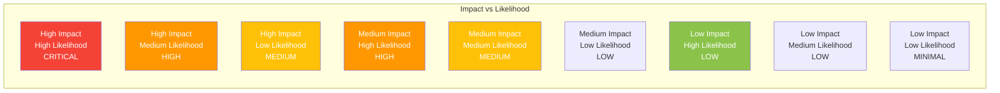

# 11. Technical Risks

**General Purpose:** Identify risks affecting system stability or project success.

## Risk Management Overview

This chapter identifies technical risks that could impact the EPC system's reliability, performance, or maintainability. Each risk is assessed for likelihood and impact, with mitigation strategies defined.

### Risk Assessment Matrix



## Critical Risks

### RISK-001: ELM Server API Changes Breaking Integration

**Category:** Integration Risk  
**Likelihood:** Medium (40% over 2 years) **(AI-Generated Placeholder)**  
**Impact:** High  
**Risk Level:** 🔴 **HIGH**

#### Description
The EPC system integrates with IBM ELM (Engineering Lifecycle Management) servers via REST APIs and Template Exchange Utility. IBM may introduce breaking changes to their APIs or XML schema in future ELM versions, which would break EPC's integration.

#### Impact Analysis
- **Functional Impact:** Unable to sync project data, deploy configurations fails
- **User Impact:** System becomes unusable for new configurations
- **Business Impact:** Project delays, manual XML editing required (defeating purpose of EPC)
- **Recovery Time:** 2-4 weeks to adapt to API changes **(AI-Generated Placeholder)**

#### Probability Factors
- ELM is actively developed; version updates occur annually **(AI-Generated Placeholder)**
- IBM has history of API changes between major versions
- EPC uses multiple ELM API endpoints (project areas, work item types, workflows)
- Template Exchange Utility depends on XML schema

#### Mitigation Strategies

**Prevention:**
1. **Version Pinning:** Document exact ELM version EPC is tested against
2. **API Abstraction Layer:** Isolate ELM-specific code in `AlmServerConnection` class
3. **Comprehensive Integration Tests:** Detect API changes early
4. **IBM Release Monitoring:** Subscribe to ELM release notes

**Detection:**
1. **Automated Health Checks:** Periodic API connectivity tests
2. **Version Compatibility Check:** Compare ELM version with supported list
3. **Error Monitoring:** Alert on repeated ELM API failures

**Response:**
1. **Emergency Fallback:** Support manual XML export if ELM deployment fails
2. **Rapid Update Process:** Have development resources ready for emergency patches
3. **Multiple ELM Version Support:** Maintain compatibility matrix

**Current Status:** 🟡 Monitored
- Abstraction layer exists (`AlmServerConnection`)
- No automated ELM version compatibility checking
- **Action Required:** Implement ELM version detection and compatibility warnings

---

### RISK-002: Database Performance Degradation Under Load

**Category:** Performance Risk  
**Likelihood:** Medium (30% within 1 year) **(AI-Generated Placeholder)**  
**Impact:** High  
**Risk Level:** 🔴 **HIGH**

#### Description
As the number of project areas, roles, and permissions grows, database queries may become slow, especially for complex joins (e.g., roles with permissions with workflow states). This could degrade user experience to unacceptable levels.

#### Impact Analysis
- **Performance Impact:** API response times > 10 seconds **(AI-Generated Placeholder)**
- **User Impact:** Poor user experience, timeout errors
- **Scalability Impact:** Cannot support additional project areas
- **Business Impact:** Reduced productivity, user complaints

#### Indicators of This Risk
- More than 50 project areas **(AI-Generated Placeholder)**
- More than 500 roles total **(AI-Generated Placeholder)**
- More than 10,000 attribute permission conditions **(AI-Generated Placeholder)**
- Complex queries with 5+ table joins

#### Mitigation Strategies

**Prevention:**
1. **Database Indexing:**
   ```sql
   CREATE INDEX idx_role_project ON elm_role(project_area_id);
   CREATE INDEX idx_mapping_role ON role_perm_mapping(role_id);
   CREATE INDEX idx_attr_perm_project ON attr_perm_condition(project_area_id);
   CREATE INDEX idx_request_status ON request(status, created_date);
   ```

2. **Query Optimization:**
   - Use `@EntityGraph` to prevent N+1 queries
   - Implement pagination for large result sets
   - Use database views for complex queries

3. **Caching Strategy:**
   - Cache project area metadata (1 hour TTL)
   - Cache role definitions (1 hour TTL)
   - Query cache for repeated queries

**Detection:**
1. **Performance Monitoring:**
   - Track average query execution time
   - Alert when queries > 1 second **(AI-Generated Placeholder)**
   - Identify slow queries in logs

2. **Capacity Planning:**
   - Monitor database size growth
   - Track number of records per table
   - Project future capacity needs

**Response:**
1. **Short-term:** Database query tuning, add indexes
2. **Medium-term:** Implement read replicas for reporting queries
3. **Long-term:** Consider data archiving strategy for old requests

**Current Status:** 🟢 Low Risk Currently
- Database has ~20 project areas currently **(AI-Generated Placeholder)**
- Ehcache reduces query load by ~60% **(AI-Generated Placeholder)**
- **Action Required:** Implement query performance monitoring

---

### RISK-003: WorkON System Unavailability Blocking Operations

**Category:** Dependency Risk  
**Likelihood:** Low (10% downtime annually) **(AI-Generated Placeholder)**  
**Impact:** High  
**Risk Level:** 🟡 **MEDIUM**

#### Description
EPC depends on the WorkON system for approval workflow. If WorkON is unavailable, users cannot submit new requests or check request status, blocking critical operations.

#### Impact Analysis
- **Functional Impact:** Cannot submit new configuration requests
- **User Impact:** Workflow disruption, delays in deployments
- **Business Impact:** Project delays if urgent changes needed
- **Duration:** Typically 1-4 hours for WorkON maintenance **(AI-Generated Placeholder)**

#### Probability Factors
- WorkON is external system outside EPC control
- WorkON may have scheduled maintenance windows
- Network issues between EPC and WorkON
- WorkON API rate limiting or throttling

#### Mitigation Strategies

**Prevention:**
1. **Loose Coupling:** WorkON integration is asynchronous
2. **Circuit Breaker Pattern:** Prevent cascading failures
   ```java
   @CircuitBreaker(name = "workon", fallbackMethod = "workOnFallback")
   public WorkOnResponse submitRequest(WorkOnRequest request) {
       return workOnClient.submit(request);
   }
   ```

3. **Retry with Exponential Backoff:**
   ```java
   @Retry(name = "workon", maxAttempts = 3, delay = 5000)
   ```

**Detection:**
1. **Health Check Endpoint:** Periodic WorkON API ping
2. **Integration Monitoring:** Track WorkON API success/failure rates
3. **Alert on Repeated Failures:** > 3 consecutive failures

**Response:**
1. **Request Queueing:** Queue requests locally if WorkON unavailable
2. **Batch Submission:** Submit queued requests when WorkON recovers
3. **Manual Override:** Admin can mark request as approved manually (with audit log) for emergencies
4. **User Communication:** Display clear message about WorkON status

**Current Status:** 🟢 Acceptable
- Retry mechanism implemented
- **Action Required:** Implement local request queueing for offline mode

---

## High Risks

### RISK-004: LDAP Authentication Service Failure

**Category:** Security/Availability Risk  
**Likelihood:** Low (5% annually) **(AI-Generated Placeholder)**  
**Impact:** High  
**Risk Level:** 🟡 **MEDIUM**

#### Description
EPC requires LDAP authentication for all users. If LDAP server is unreachable, no users can log in, making the system completely unavailable.

#### Impact Analysis
- **Availability Impact:** System unusable for all users
- **Duration:** Depends on LDAP recovery (typically 1-2 hours) **(AI-Generated Placeholder)**
- **Workaround:** None - no alternative authentication method

#### Mitigation Strategies

**Prevention:**
1. **LDAP High Availability:** Use LDAP cluster (multiple servers)
2. **Connection Pooling:** Reuse LDAP connections
3. **Timeout Configuration:** Fail fast if LDAP unreachable (5-second timeout)

**Detection:**
1. **Authentication Monitoring:** Track authentication success/failure rates
2. **LDAP Health Check:** Periodic connectivity test

**Response:**
1. **User Communication:** Display clear error message
2. **Escalation:** Automatic alert to IT if LDAP issues detected
3. **Emergency Access:** **[Define emergency access procedure if needed]**

**Current Status:** 🟢 Acceptable
- LDAP has high availability infrastructure
- **Action Required:** Document emergency access procedure

---

### RISK-005: XML Configuration Deployment Failure

**Category:** Operational Risk  
**Likelihood:** Medium (20% of deployments) **(AI-Generated Placeholder)**  
**Impact:** Medium  
**Risk Level:** 🟡 **MEDIUM**

#### Description
After generating XML configuration, deployment to ELM server may fail due to:
- XML validation errors on ELM side
- Conflicts with existing configurations
- ELM server errors
- Network issues during upload

#### Impact Analysis
- **User Impact:** Configuration not applied, request stuck in "failed" state
- **Recovery:** Manual investigation and retry required
- **Frequency:** Estimated 20% of deployments have issues initially **(AI-Generated Placeholder)**

#### Mitigation Strategies

**Prevention:**
1. **Pre-deployment Validation:**
   - Validate XML against ELM schema before upload
   - Check for conflicts with existing configurations
   - Dry-run mode to test without applying

2. **XML Quality Checks:**
   ```java
   public void validateXML(String xml) {
       // Schema validation
       SchemaFactory.newInstance(XMLConstants.W3C_XML_SCHEMA_NS_URI)
           .newSchema(new File("elm-schema.xsd"))
           .newValidator()
           .validate(new StreamSource(new StringReader(xml)));
       
       // Business rule validation
       validateNoDuplicateRoles(xml);
       validatePermissionReferences(xml);
   }
   ```

**Detection:**
1. **Deployment Status Tracking:** Monitor each deployment step
2. **Detailed Error Logging:** Capture ELM server error messages
3. **Metrics:** Track deployment success/failure rates

**Response:**
1. **Automatic Retry:** For transient errors (network timeouts)
2. **Error Analysis:** Parse ELM error messages, provide guidance
3. **Manual Intervention UI:** Allow admin to edit XML and retry
4. **Rollback Support:** Restore previous configuration if needed

**Current Status:** 🟡 Needs Improvement
- XML schema validation implemented
- **Action Required:** Implement dry-run mode and rollback support

---

### RISK-006: Security Vulnerability in Dependencies

**Category:** Security Risk  
**Likelihood:** High (CVEs discovered regularly) **(AI-Generated Placeholder)**  
**Impact:** Medium to High (depends on vulnerability)  
**Risk Level:** 🟡 **MEDIUM TO HIGH**

#### Description
EPC depends on numerous third-party libraries (Spring Boot, Hibernate, MySQL driver, etc.). Security vulnerabilities (CVEs) are regularly discovered in these dependencies, potentially exposing EPC to attacks.

#### Impact Analysis
- **Security Impact:** Depends on vulnerability (data breach, DoS, RCE, etc.)
- **Compliance Impact:** May violate Bosch security policies
- **Reputation Impact:** Security incidents damage trust
- **Remediation Time:** 1 day to 2 weeks depending on complexity **(AI-Generated Placeholder)**

#### Vulnerable Dependencies Risk
- Spring Boot 2.2.8 (released 2020) - may have known CVEs
- Transitive dependencies not regularly audited
- MySQL Connector, Jackson, Logback, etc.

#### Mitigation Strategies

**Prevention:**
1. **Dependency Scanning:**
   ```xml
   <!-- Maven dependency check plugin -->
   <plugin>
       <groupId>org.owasp</groupId>
       <artifactId>dependency-check-maven</artifactId>
       <executions>
           <execution>
               <goals><goal>check</goal></goals>
           </execution>
       </executions>
   </plugin>
   ```

2. **Regular Updates:**
   - Quarterly dependency updates
   - Immediate patches for critical CVEs
   - Automated pull requests for dependency updates (Dependabot)

3. **Security Policy:**
   - Use only approved dependencies
   - Review security advisories before adding dependencies

**Detection:**
1. **CI/CD Integration:** Fail builds on high-severity CVEs
2. **Monitoring Services:** Snyk, WhiteSource, or OWASP Dependency-Check
3. **Security Alerts:** Subscribe to Spring Security advisories

**Response:**
1. **Rapid Patching:** Hot-fix process for critical vulnerabilities
2. **Risk Assessment:** Evaluate exploitability and impact
3. **Temporary Mitigation:** WAF rules or network restrictions while patching

**Current Status:** 🔴 Attention Required
- Spring Boot 2.2.8 is outdated (current: 3.x)
- **Action Required:** Plan Spring Boot upgrade to 2.7.x LTS or 3.x

---

## Medium Risks

### RISK-007: Ehcache Memory Leak or Excessive Growth

**Category:** Performance/Stability Risk  
**Likelihood:** Low (15%) **(AI-Generated Placeholder)**  
**Impact:** Medium  
**Risk Level:** 🟢 **LOW TO MEDIUM**

#### Description
Ehcache stores frequently accessed data in application memory. If cache configuration is incorrect or cache eviction doesn't work properly, memory usage could grow unbounded, causing OutOfMemoryError.

#### Impact Analysis
- **Stability Impact:** Application crashes with OutOfMemoryError
- **Recovery:** Requires application restart
- **Data Loss:** None (data in database)
- **Frequency:** Rare with proper configuration

#### Mitigation Strategies

**Prevention:**
1. **Cache Size Limits:**
   ```xml
   <cache name="projectAreas"
          maxEntriesLocalHeap="1000"
          timeToLiveSeconds="3600"
          memoryStoreEvictionPolicy="LRU"/>
   ```

2. **Heap Size Configuration:**
   ```bash
   -Xms2048m -Xmx4096m -XX:+HeapDumpOnOutOfMemoryError
   ```

3. **Cache Statistics Monitoring:** Track cache size, hit/miss ratio

**Detection:**
1. **Memory Monitoring:** Alert when heap usage > 80%
2. **Cache Statistics:** Monitor cache entry count
3. **Heap Dumps:** Automatic dump on OOM for analysis

**Response:**
1. **Clear Cache:** Endpoint to manually clear cache
2. **Adjust Configuration:** Reduce cache size or TTL
3. **Disable Caching:** Ability to disable cache if issues persist

**Current Status:** 🟢 Low Risk
- Cache limits configured
- **Action Required:** Add cache statistics monitoring dashboard

---

### RISK-008: Scheduled Jobs Failure

**Category:** Operational Risk  
**Likelihood:** Medium (25%) **(AI-Generated Placeholder)**  
**Impact:** Low to Medium  
**Risk Level:** 🟢 **LOW TO MEDIUM**

#### Description
EPC has scheduled jobs (ELM sync, request processing, WorkON status sync). If jobs fail repeatedly, data becomes stale and requests are not processed.

#### Job Failure Scenarios
- **ELM Sync Job:** Project data becomes outdated
- **Request Processing Job:** Approved requests not deployed
- **WorkON Status Sync:** Request statuses not updated

#### Mitigation Strategies

**Prevention:**
1. **Job Monitoring:** Log every job execution with outcome
2. **Error Handling:** Graceful failure, don't crash application
3. **Retry Logic:** Exponential backoff for transient failures

**Detection:**
1. **Job Status Endpoint:** API to check last successful execution
2. **Alert on Repeated Failures:** > 3 consecutive failures
3. **Dashboard:** Display job health status

**Response:**
1. **Manual Job Trigger:** API endpoint to trigger jobs manually
2. **Skip Failed Items:** Continue processing other items if one fails
3. **Notification:** Email admin on repeated failures

**Current Status:** 🟡 Needs Improvement
- **Action Required:** Implement job monitoring dashboard

---

## Low Risks

### RISK-009: Database Backup Corruption or Failure

**Category:** Data Loss Risk  
**Likelihood:** Very Low (2%) **(AI-Generated Placeholder)**  
**Impact:** High (but very unlikely)  
**Risk Level:** 🟢 **LOW**

#### Mitigation
- Regular backup verification
- Multiple backup copies (onsite + offsite)
- Tested restore procedures

---

### RISK-010: Team Knowledge Loss

**Category:** Organizational Risk  
**Likelihood:** Medium (30%) **(AI-Generated Placeholder)**  
**Impact:** Low to Medium  
**Risk Level:** 🟢 **LOW TO MEDIUM**

#### Description
Key developers leave, taking institutional knowledge about EPC architecture, ELM integration, and business logic.

#### Mitigation Strategies
- Comprehensive documentation (this document!)
- Code comments and Javadoc
- Knowledge sharing sessions
- Pair programming
- Cross-training team members

---

## Risk Summary Dashboard

| Risk ID | Risk Name | Likelihood | Impact | Level | Status |
|---------|-----------|------------|--------|-------|--------|
| RISK-001 | ELM API Changes | Medium | High | 🔴 HIGH | 🟡 Monitored |
| RISK-002 | Database Performance | Medium | High | 🔴 HIGH | 🟢 Low Currently |
| RISK-003 | WorkON Unavailability | Low | High | 🟡 MEDIUM | 🟢 Acceptable |
| RISK-004 | LDAP Failure | Low | High | 🟡 MEDIUM | 🟢 Acceptable |
| RISK-005 | XML Deployment Failure | Medium | Medium | 🟡 MEDIUM | 🟡 Needs Improvement |
| RISK-006 | Dependency Vulnerabilities | High | Medium-High | 🟡 MEDIUM-HIGH | 🔴 Attention Required |
| RISK-007 | Ehcache Memory Leak | Low | Medium | 🟢 LOW-MEDIUM | 🟢 Low Risk |
| RISK-008 | Scheduled Jobs Failure | Medium | Low-Medium | 🟢 LOW-MEDIUM | 🟡 Needs Improvement |
| RISK-009 | Backup Corruption | Very Low | High | 🟢 LOW | 🟢 Acceptable |
| RISK-010 | Knowledge Loss | Medium | Low-Medium | 🟢 LOW-MEDIUM | 🟢 Mitigated |

## Action Items

### Immediate (Within 1 Month)
1. ✅ Implement ELM version detection and compatibility warnings (RISK-001)
2. ✅ Implement query performance monitoring (RISK-002)
3. ✅ Add dependency security scanning to CI/CD (RISK-006)

### Short-term (Within 3 Months)
4. ⏳ Plan Spring Boot upgrade from 2.2.8 to 2.7.x (RISK-006)
5. ⏳ Implement local request queueing for WorkON offline mode (RISK-003)
6. ⏳ Implement XML deployment dry-run mode (RISK-005)
7. ⏳ Create job monitoring dashboard (RISK-008)

### Long-term (Within 6-12 Months)
8. ⏳ Implement XML deployment rollback support (RISK-005)
9. ⏳ Database read replica for reporting queries (RISK-002)
10. ⏳ Cache statistics monitoring dashboard (RISK-007)

## Risk Review Process

**Frequency:** Quarterly  
**Participants:** Development Team, Operations Team, Product Owner  
**Activities:**
- Review risk status
- Update likelihood/impact assessments
- Identify new risks
- Review mitigation effectiveness
- Adjust priorities
