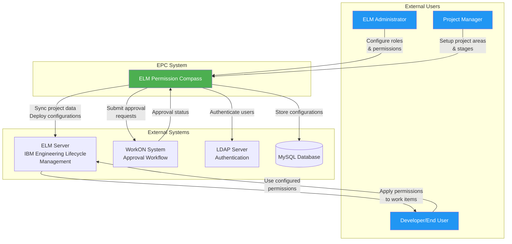
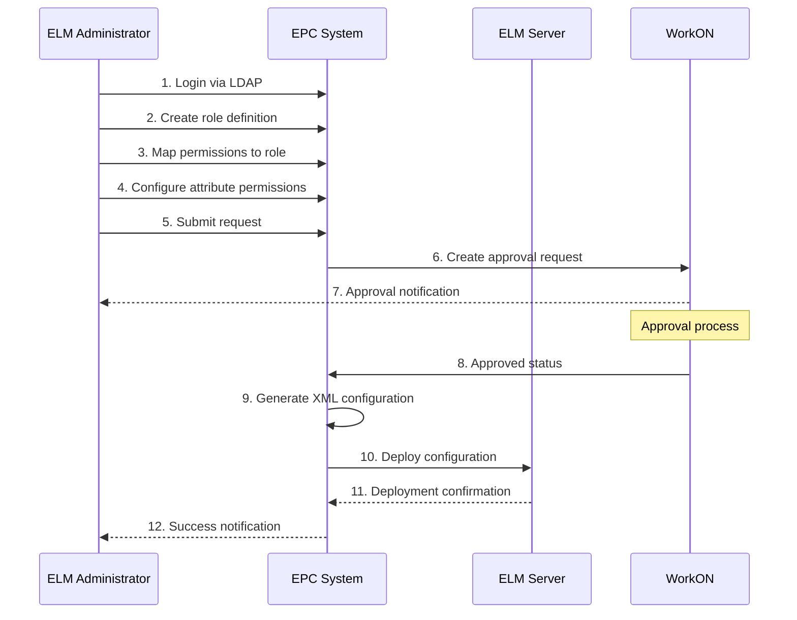
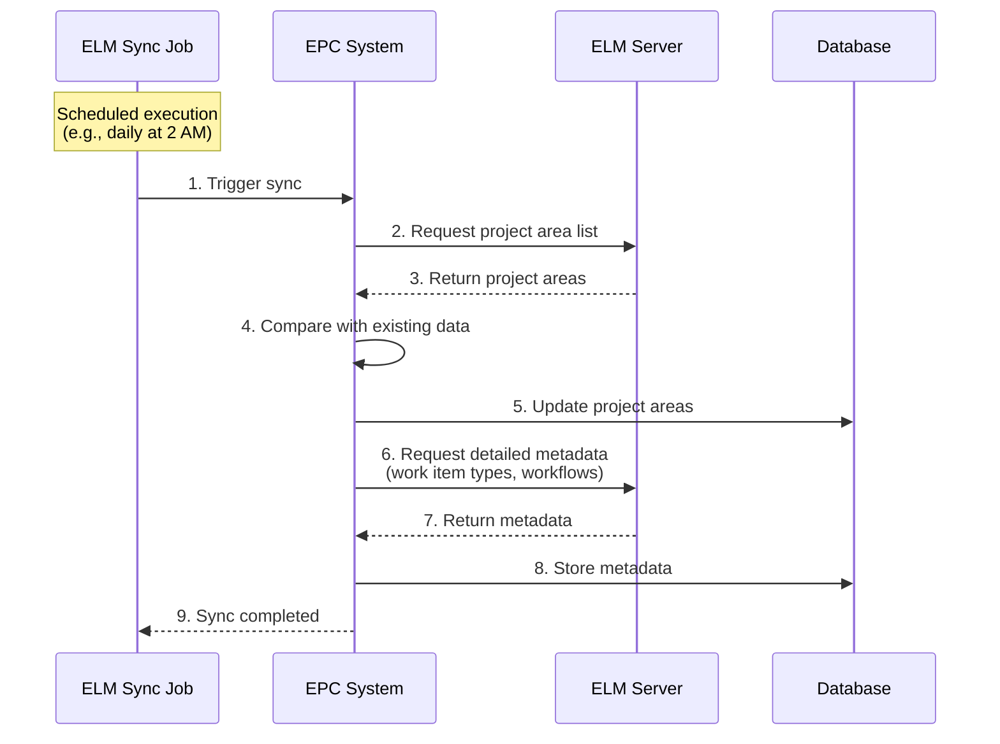
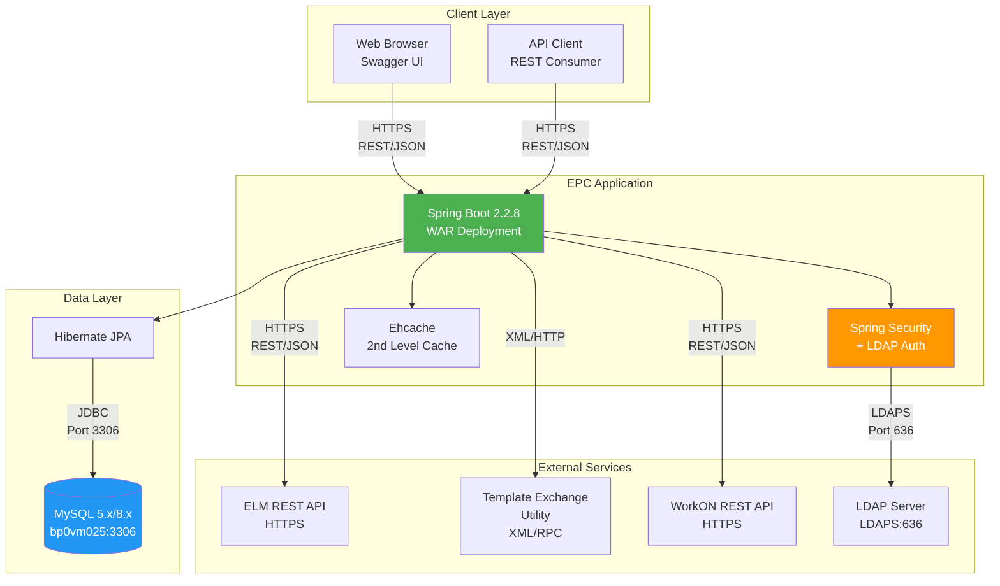

# 3. System Scope and Context

**General Purpose:** Define the boundaries of the system and its interfaces with external entities.

## 3.1 Business Context

**General Purpose:** Describe external systems and users from a business perspective.

### Context Diagram



### Business Context Table

| Entity | Input to EPC | Output from EPC | Purpose |
|--------|-------------|-----------------|---------|
| **ELM Administrator** | • Role definitions<br>• Permission mappings<br>• Attribute configurations<br>• Configuration change requests | • Configuration status<br>• Validation results<br>• Deployment reports<br>• Audit logs | Primary user who manages all aspects of ELM permissions. Creates and maintains role/permission configurations for projects. |
| **Project Manager** | • Project area selections<br>• Stage-based role assignments<br>• Approval requests | • Available project areas<br>• Current role assignments<br>• Request status | Sets up and manages permissions for specific project areas. Defines stage-specific roles. |
| **Developer/End User** | N/A (indirect) | N/A (indirect) | Benefits from correctly configured permissions in ELM. Does not interact directly with EPC. |
| **ELM Server** | • Project area list<br>• Work item types<br>• Workflow states<br>• Existing roles<br>• Attribute definitions | • XML configuration files<br>• Role definitions<br>• Permission assignments<br>• Attribute permissions | Source of project metadata and target for permission configurations. ELM applies configurations to control user access. |
| **WorkON System** | • Approval/rejection decisions<br>• Approval comments<br>• Status updates | • Configuration change requests<br>• Request details<br>• Requestor information | Manages approval workflow for configuration changes. Ensures changes are reviewed before deployment. |
| **LDAP Server** | • User credentials<br>• User group memberships<br>• Authentication tokens | • Authentication requests<br>• User attribute queries | Provides centralized authentication. Validates user identity and retrieves user roles. |
| **MySQL Database** | N/A (internal) | N/A (internal) | Stores all EPC data including configurations, requests, mappings, and audit logs. |

### Business Processes

#### Process 1: Create New Role Configuration



#### Process 2: Synchronize Project Areas



### Business Goals and Context

| Business Goal | How EPC Supports It |
|---------------|---------------------|
| **Reduce Manual Effort** | Automates XML generation and validation that previously required manual editing |
| **Improve Accuracy** | Validates configurations before deployment, preventing broken permissions |
| **Ensure Compliance** | Enforces approval workflow via WorkON integration |
| **Standardize Permissions** | Provides templates and reusable role/permission patterns |
| **Enable Self-Service** | Allows project managers to configure their own project permissions |
| **Maintain Audit Trail** | Logs all configuration changes with user, timestamp, and approval status |

## 3.2 Technical Context

**General Purpose:** Describe external systems and their communication in a technical sense.

### Technical Context Diagram



### Technical Interfaces

#### Interface 1: Client ↔ EPC (REST API)

| Aspect | Details |
|--------|---------|
| **Protocol** | HTTPS **(Project-Sourced)** |
| **Format** | JSON (request and response bodies) |
| **API Style** | REST with standard HTTP methods |
| **Authentication** | Session-based after LDAP login |
| **Documentation** | Swagger UI at `/swagger-ui.html` **(Project-Sourced)** |
| **Base Path** | `/api/*` **(Project-Sourced from controllers)** |
| **Content-Type** | `application/json` |
| **Character Encoding** | UTF-8 |

**Key Endpoints:**
```
GET    /api/roles/getAllRoles
POST   /api/roles/createRole
GET    /api/permissions/getAllPermissions
POST   /api/attrperm/saveAttrPermCondition
GET    /api/projectarea/getProjectAreas
POST   /api/request/createRequest
GET    /api/request/getRequestStatus/{id}
```

#### Interface 2: EPC ↔ MySQL Database (JDBC)

| Aspect | Details |
|--------|---------|
| **Protocol** | JDBC over TCP/IP |
| **Driver** | MySQL Connector/J **(Project-Sourced from pom.xml)** |
| **Host** | bp0vm025.emea.bosch.com **(Project-Sourced)** |
| **Port** | 3306 **(Project-Sourced)** |
| **Database** | epc **(Project-Sourced)** |
| **Connection Pool** | HikariCP (Spring Boot default) |
| **ORM** | Hibernate JPA **(Project-Sourced)** |
| **Dialect** | MySQL5Dialect / MySQL8Dialect |
| **Transaction Isolation** | READ_COMMITTED (default) |

**Connection String:**
```
jdbc:mysql://bp0vm025.emea.bosch.com:3306/epc
```

**Key Database Objects:**
- Tables: `elm_role`, `elm_permissions`, `role_perm_mapping`, `attr_perm_condition`, `project_area`, `request`, `stages`, etc.
- Relationships: JPA entity relationships with foreign keys
- Indexes: Primary keys, foreign keys, query optimization indexes

#### Interface 3: EPC ↔ ELM Server (REST API)

| Aspect | Details |
|--------|---------|
| **Protocol** | HTTPS |
| **Format** | JSON (for REST API), XML (for configurations) |
| **Authentication** | Basic Authentication or OAuth **(AI-Generated Placeholder)** |
| **ELM Base URL** | Configured per project area (e.g., `https://elm.bosch.com/ccm`) |
| **API Version** | ELM 7.x API **(AI-Generated Placeholder)** |
| **Purpose** | • Retrieve project area metadata<br>• Fetch work item types and attributes<br>• Get workflow definitions<br>• Query existing roles |

**Key API Calls:**
```
GET  /ccm/oslc/projectareas
GET  /ccm/oslc/types/{projectArea}
GET  /ccm/process/project-areas/{id}/roles
GET  /ccm/process/project-areas/{id}/team-areas
```

**XML Configuration Deployment:**
- Uses Template Exchange Utility (TEU)
- XML files conform to RTC/ELM process template schema
- Deployment via process template import

#### Interface 4: EPC ↔ Template Exchange Utility (TEU)

| Aspect | Details |
|--------|---------|
| **Purpose** | Deploy XML configurations to ELM server |
| **Type** | Library/Utility integration **(Project-Sourced from code)** |
| **Input Format** | XML configuration files (roles, permissions, conditions) |
| **Output** | Deployment status, error logs |
| **Key Classes** | `TEUUtility`, `XMLGenerator`, `XMLMerger` **(Project-Sourced)** |
| **Workflow** | 1. Generate XML from database<br>2. Validate XML structure<br>3. Merge with process template<br>4. Upload to ELM server<br>5. Apply configuration |

#### Interface 5: EPC ↔ WorkON System (REST API)

| Aspect | Details |
|--------|---------|
| **Protocol** | HTTPS |
| **Format** | JSON **(Project-Sourced from workonRequest.json)** |
| **Purpose** | Submit configuration change requests for approval |
| **Authentication** | API Key or Service Account **(AI-Generated Placeholder)** |
| **Request Format** | WorkOnRequest model **(Project-Sourced)** |
| **Response Format** | WorkOnResponse model **(Project-Sourced)** |

**Key Operations:**
```java
// Submit request for approval
POST /workon/api/requests
{
  "requestType": "EPC_CONFIG_CHANGE",
  "requestor": "user@bosch.com",
  "description": "Add new role: Developer",
  "approvers": ["manager@bosch.com"],
  "requestData": { ... }
}

// Check request status
GET /workon/api/requests/{requestId}/status

// Response statuses
- PENDING: Awaiting approval
- APPROVED: Approved, ready for deployment
- REJECTED: Rejected with comments
- COMPLETED: Deployed successfully
```

#### Interface 6: EPC ↔ LDAP Server (LDAPS)

| Aspect | Details |
|--------|---------|
| **Protocol** | LDAPS (LDAP over SSL) **(Project-Sourced)** |
| **Port** | 636 (LDAPS standard port) **(AI-Generated Placeholder)** |
| **Purpose** | User authentication and authorization |
| **LDAP Server** | Bosch Active Directory **(AI-Generated Placeholder)** |
| **Base DN** | **[Provide LDAP base DN]** |
| **User DN Pattern** | **[Provide user DN pattern]** |
| **Group Search** | Enabled for role mapping **(AI-Generated Placeholder)** |

**Authentication Flow:**
```
1. User submits credentials
2. Spring Security contacts LDAP
3. LDAP validates credentials
4. LDAP returns user attributes and groups
5. Spring Security maps LDAP groups to EPC roles
6. Session created with user authorities
```

### Data Formats

#### JSON Request/Response Example
```json
{
  "id": 123,
  "roleName": "Developer",
  "roleDescription": "Development team member",
  "permissions": [
    {
      "permissionId": 45,
      "permissionName": "Modify Work Items",
      "category": "TEAM_OPERATION"
    }
  ],
  "projectAreas": ["ProjectA", "ProjectB"]
}
```

#### XML Configuration Example
```xml
<?xml version="1.0" encoding="UTF-8"?>
<process:role-definitions xmlns:process="http://www.ibm.com/xmlns/prod/jazz/process/1.0/">
  <role id="developer" name="Developer">
    <description>Development team member</description>
    <permissions>
      <permission operation="com.ibm.team.workitem.operation.workItemSave"/>
      <permission operation="com.ibm.team.workitem.operation.workItemModify"/>
    </permissions>
  </role>
</process:role-definitions>
```

### Error Handling

| Error Scenario | HTTP Status | Response Format |
|----------------|-------------|-----------------|
| Resource not found | 404 | `{"error": "ResourceNotFoundExcepti", "message": "..."}` |
| Validation failure | 400 | `{"error": "ValidationException", "message": "...", "fields": [...]}` |
| Authentication failure | 401 | `{"error": "Unauthorized", "message": "Authentication required"}` |
| Authorization failure | 403 | `{"error": "Forbidden", "message": "Insufficient permissions"}` |
| Server error | 500 | `{"error": "InternalServerError", "message": "..."}` |
| ELM server unavailable | 503 | `{"error": "ServiceUnavailable", "message": "ELM server not reachable"}` |

### Network and Security

| Aspect | Configuration |
|--------|--------------|
| **Firewall Rules** | EPC server must reach:<br>• MySQL: Port 3306<br>• ELM: Port 443<br>• LDAP: Port 636<br>• WorkON: Port 443 |
| **SSL/TLS** | Required for all external communications |
| **CSRF Protection** | Enabled via Spring Security **(Project-Sourced from SecurityConfig)** |
| **Session Timeout** | 30 minutes of inactivity **(AI-Generated Placeholder)** |
| **Password Policy** | Managed by LDAP (not stored in EPC) |
