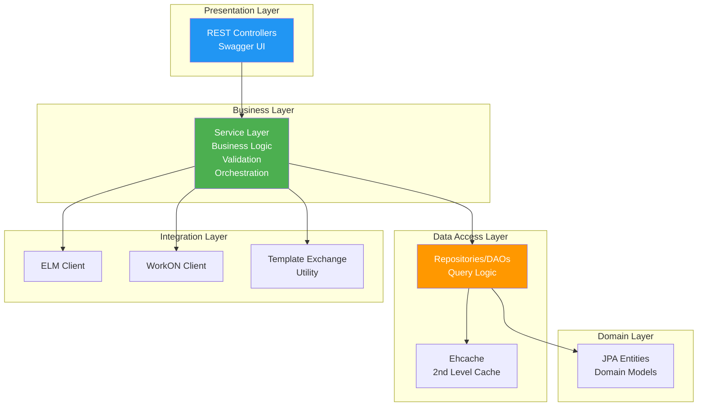
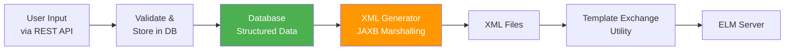
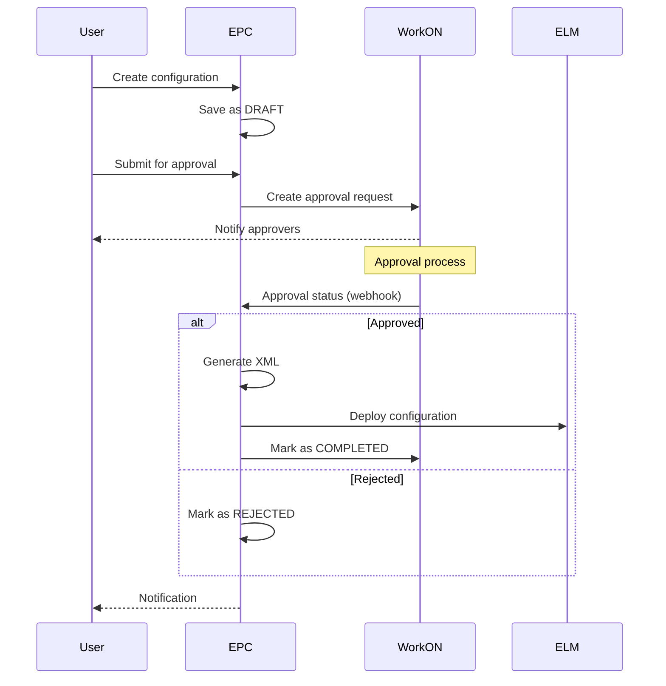
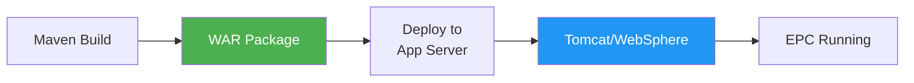

# 4. Solution Strategy

**General Purpose:** High-level approach and key technologies to achieve system goals.

## Overview

The EPC system adopts a **layered architecture** pattern with **Spring Boot** as the foundation, providing a clean separation between presentation, business logic, and data access layers. The solution strategy emphasizes **automation**, **validation**, and **integration** to eliminate manual XML editing and reduce configuration errors.

## Strategic Decisions

### 1. Technology Stack Selection

| Component | Technology | Rationale |
|-----------|----------|-----------|
| **Application Framework** | Spring Boot 2.2.8 **(Project-Sourced)** | • Rapid development with auto-configuration<br>• Comprehensive ecosystem (Security, Data, REST)<br>• Bosch-approved enterprise framework<br>• Strong community and documentation |
| **Web Layer** | Spring MVC REST **(Project-Sourced)** | • RESTful API design for loose coupling<br>• JSON for lightweight data exchange<br>• Easy integration with Swagger for documentation |
| **Security** | Spring Security + LDAP **(Project-Sourced)** | • Mature security framework<br>• LDAP integration for centralized authentication<br>• Built-in CSRF protection<br>• Role-based access control |
| **Persistence** | JPA/Hibernate **(Project-Sourced)** | • ORM eliminates boilerplate SQL<br>• Database abstraction<br>• Transaction management<br>• Lazy loading and caching support |
| **Database** | MySQL **(Project-Sourced)** | • Existing Bosch infrastructure<br>• Reliable and proven technology<br>• Good performance for relational data |
| **Caching** | Ehcache **(Project-Sourced)** | • Reduces database load for frequent queries<br>• Embedded solution (no separate server)<br>• Hibernate 2nd-level cache support |
| **XML Processing** | JAXB **(Project-Sourced)** | • Standard Java API for XML marshalling<br>• Type-safe object-to-XML mapping<br>• Required for ELM configuration format |
| **API Documentation** | Swagger/OpenAPI 3 **(Project-Sourced)** | • Interactive API exploration<br>• Automatic documentation from code<br>• Testing capabilities for developers |
| **Build Tool** | Maven **(Project-Sourced)** | • Bosch standard<br>• Dependency management<br>• Plugin ecosystem for packaging and testing |

### 2. Architectural Patterns

#### Layered Architecture



**Benefits:**
- **Separation of Concerns:** Each layer has distinct responsibility
- **Maintainability:** Changes in one layer don't cascade to others
- **Testability:** Layers can be tested independently
- **Flexibility:** Easy to swap implementations (e.g., database)

#### Repository Pattern

```java
// Interface defines contract
public interface ELMRoleRepository extends JpaRepository<ELMRole, Long> {
    List<ELMRole> findByProjectAreaName(String projectAreaName);
    Optional<ELMRole> findByRoleName(String roleName);
}

// Spring Data JPA provides implementation automatically
```

**Benefits:**
- Abstracts data access details
- Promotes testability (easy to mock)
- Reduces boilerplate code
- Consistent query interface

#### Service Layer Pattern

```java
@Service
@Transactional
public class ELMRoleServiceImpl implements ELMRoleService {
    
    @Autowired
    private ELMRoleRepository roleRepository;
    
    @Autowired
    private PermissionService permissionService;
    
    @Override
    public ELMRole createRole(RoleRequest request) {
        // Business logic, validation, orchestration
        validateRoleName(request.getRoleName());
        ELMRole role = mapToEntity(request);
        role = roleRepository.save(role);
        permissionService.mapPermissions(role, request.getPermissionIds());
        return role;
    }
}
```

**Benefits:**
- Encapsulates business logic
- Transaction boundaries
- Orchestrates multiple repositories
- Reusable business operations

### 3. Key Technical Strategies

#### Strategy 1: Configuration-as-Code

**Approach:** Store all permission configurations in database as structured data, generate XML on-demand.



**Benefits:**
- Version control of configurations
- Easy rollback (restore database state)
- Query capabilities for reporting
- Validation before XML generation
- Reusable configuration templates

#### Strategy 2: Approval Workflow Integration

**Approach:** Integrate with WorkON system to enforce governance.



**Benefits:**
- Enforces governance and compliance
- Audit trail of approvals
- Prevents unauthorized changes
- Separation of request and execution

#### Strategy 3: Scheduled Data Synchronization

**Approach:** Use Spring's `@Scheduled` jobs to keep EPC data in sync with ELM.

```java
@Scheduled(cron = "0 0 2 * * *") // Daily at 2 AM
public void syncProjectAreas() {
    List<ProjectArea> elmProjectAreas = elmClient.fetchProjectAreas();
    syncService.updateLocalDatabase(elmProjectAreas);
}

@Scheduled(cron = "0 */15 * * * *") // Every 15 minutes
public void syncRequestStatus() {
    List<Request> pendingRequests = requestRepo.findByStatus("PENDING");
    for (Request req : pendingRequests) {
        WorkOnStatus status = workOnClient.getStatus(req.getWorkOnId());
        req.setStatus(status.getStatus());
        requestRepo.save(req);
    }
}
```

**Benefits:**
- Fresh data from ELM servers
- Reduced load on ELM (batch operations)
- User sees up-to-date project information
- Automatic status updates

#### Strategy 4: Caching Strategy

**Approach:** Use Ehcache for frequently accessed, rarely changed data.

```java
@Cacheable(value = "projectAreas", key = "#projectAreaName")
public ProjectArea getProjectArea(String projectAreaName) {
    return projectAreaRepository.findByName(projectAreaName)
        .orElseThrow(() -> new ResourceNotFoundException("Project area not found"));
}

@CacheEvict(value = "projectAreas", allEntries = true)
@Scheduled(cron = "0 0 3 * * *") // Clear cache daily at 3 AM
public void clearCache() {
    // Cache cleared automatically
}
```

**Cached Data:**
- Project areas
- ELM roles
- Workflow states
- Work item types
- Built-in attributes

**Benefits:**
- Faster response times (no database query)
- Reduced database load
- Better user experience

### 4. Quality Strategy

#### Testing Strategy

```
Unit Tests (70%+ coverage target)
├── Service Layer Tests
│   ├── Mock repositories
│   ├── Test business logic
│   └── Validate error handling
│
├── Controller Tests
│   ├── MockMvc for REST API
│   ├── Test request/response mapping
│   └── Validate HTTP status codes
│
└── Repository Tests
    ├── Test custom queries
    └── Validate JPA mappings

Integration Tests
├── Database Integration
│   ├── Test with H2 in-memory DB
│   └── Validate transaction handling
│
└── External System Integration
    ├── Mock ELM server responses
    └── Mock WorkON responses
```

#### Error Handling Strategy

```java
@ControllerAdvice
public class GlobalExceptionHandler {
    
    @ExceptionHandler(ResourceNotFoundException.class)
    public ResponseEntity<?> handleNotFound(ResourceNotFoundException ex) {
        return ResponseEntity.status(404).body(new ErrorResponse(ex.getMessage()));
    }
    
    @ExceptionHandler(ValidationException.class)
    public ResponseEntity<?> handleValidation(ValidationException ex) {
        return ResponseEntity.status(400).body(new ErrorResponse(ex.getMessage()));
    }
    
    @ExceptionHandler(Exception.class)
    public ResponseEntity<?> handleGeneral(Exception ex) {
        logger.error("Unexpected error", ex);
        return ResponseEntity.status(500).body(new ErrorResponse("Internal server error"));
    }
}
```

**Strategy:**
- Global exception handler for consistent error responses
- Custom exceptions for domain-specific errors
- Comprehensive logging for troubleshooting
- User-friendly error messages

#### Security Strategy

```java
@Configuration
@EnableWebSecurity
public class SecurityConfig extends WebSecurityConfigurerAdapter {
    
    @Override
    protected void configure(HttpSecurity http) throws Exception {
        http
            .authorizeRequests()
                .antMatchers("/api/admin/**").hasRole("ADMIN")
                .antMatchers("/api/**").authenticated()
                .anyRequest().permitAll()
            .and()
            .csrf().csrfTokenRepository(CookieCsrfTokenRepository.withHttpOnlyFalse())
            .and()
            .formLogin()
            .and()
            .ldapAuthentication()
                .userDnPatterns("uid={0},ou=people")
                .contextSource()
                    .url("ldap://ldap.bosch.com:636")
                    .and()
                .passwordCompare()
                    .passwordAttribute("userPassword");
    }
}
```

**Strategy:**
- LDAP authentication (no local passwords)
- Role-based authorization
- CSRF protection enabled
- Session management
- SQL injection prevention via JPA

### 5. Deployment Strategy



**Packaging:** WAR file for deployment to existing application servers **(Project-Sourced)**

**Deployment Steps:**
1. Maven clean install
2. Generate `target/epc.war`
3. Deploy to application server
4. Configure external properties (database, ELM URLs)
5. Start application
6. Verify health check endpoint

**Configuration Externalization:**
- Database connection via environment variables
- ELM server URLs configurable
- LDAP settings externalized
- Allows same WAR for multiple environments

### 6. Integration Strategy

| Integration Point | Strategy | Implementation |
|------------------|----------|----------------|
| **ELM Server** | REST API client | • Spring RestTemplate<br>• Retry logic for transient failures<br>• Connection pooling |
| **WorkON** | REST API client | • Asynchronous request submission<br>• Polling for status updates<br>• Webhook for status changes **(AI-Generated Placeholder)** |
| **LDAP** | Spring Security LDAP | • Configured in SecurityConfig<br>• User DN pattern matching<br>• Group-to-role mapping |
| **Template Exchange** | Library integration | • Custom utility classes<br>• XML generation and merging<br>• Process template manipulation |

### 7. Performance Strategy

| Technique | Implementation | Expected Impact |
|-----------|----------------|-----------------|
| **Caching** | Ehcache for reference data | 50-70% reduction in DB queries **(AI-Generated Placeholder)** |
| **Connection Pooling** | HikariCP (Spring Boot default) | Efficient database connections |
| **Lazy Loading** | JPA lazy fetch for associations | Reduced memory footprint |
| **Batch Operations** | JPA batch inserts/updates | Faster bulk operations |
| **Scheduled Jobs** | Off-peak execution (night) | No impact on business hours |
| **Async Processing** | Request processing in background | Non-blocking user interface |

## Technology Mapping to Quality Goals

| Quality Goal | Technology/Pattern | How It Helps |
|--------------|-------------------|--------------|
| **Reliability** | • JPA transactions<br>• XML validation<br>• Exception handling | Ensures data consistency and catches errors early |
| **Maintainability** | • Layered architecture<br>• Repository pattern<br>• Dependency injection | Clear structure, easy to understand and modify |
| **Usability** | • Swagger UI<br>• RESTful API<br>• JSON format | Self-documenting, easy to integrate |
| **Security** | • Spring Security<br>• LDAP<br>• CSRF protection | Multi-layered security approach |
| **Performance** | • Ehcache<br>• Connection pooling<br>• Batch processing | Reduces latency and improves throughput |
| **Testability** | • Service layer<br>• Repository interfaces<br>• Dependency injection | Easy to mock and test in isolation |

## Architecture Decision Records (ADRs)

### ADR-1: Use Spring Boot Framework
**Decision:** Adopt Spring Boot 2.2.8 as the application framework  
**Rationale:** Bosch-approved, rapid development, comprehensive ecosystem  
**Consequences:** Strong dependency on Spring; requires Spring expertise

### ADR-2: Store Configurations in Database, Not Files
**Decision:** Store all configurations as structured data in MySQL, generate XML on-demand  
**Rationale:** Better version control, query capabilities, validation, rollback support  
**Consequences:** More complex data model; XML generation adds processing time

### ADR-3: Integrate with WorkON for Approvals
**Decision:** Use WorkON system for approval workflow instead of building custom approval  
**Rationale:** Reuse existing system, compliance with organizational policy, audit trail  
**Consequences:** Dependency on external system; requires WorkON API integration

### ADR-4: Use LDAP for Authentication
**Decision:** Mandatory LDAP authentication, no local user database  
**Rationale:** Centralized authentication, security policy compliance, SSO support  
**Consequences:** Dependency on LDAP availability; requires network connectivity

### ADR-5: REST API over SOAP
**Decision:** Provide RESTful JSON API instead of SOAP  
**Rationale:** Lightweight, modern, easy to consume, Swagger documentation  
**Consequences:** No WSDL; clients must adapt to REST conventions

### ADR-6: Ehcache for Caching
**Decision:** Use Ehcache as embedded cache solution  
**Rationale:** Lightweight, no separate server, Hibernate integration  
**Consequences:** Limited to single-server caching; not distributed

### ADR-7: WAR Packaging for Deployment
**Decision:** Package as WAR file for deployment to existing app servers  
**Rationale:** Fits existing Bosch infrastructure; shared app server resources  
**Consequences:** Cannot run as standalone JAR; requires app server management
