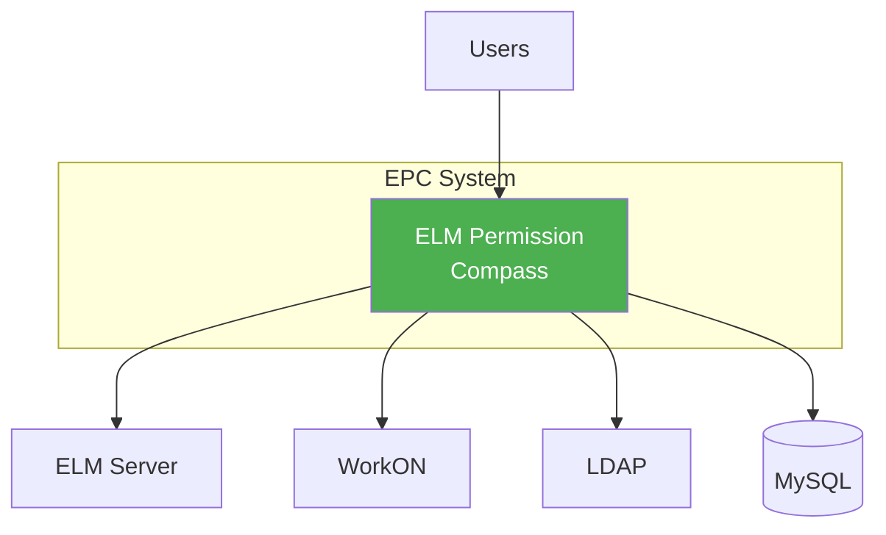
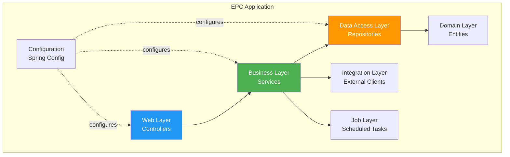
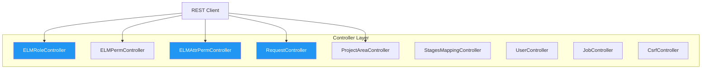
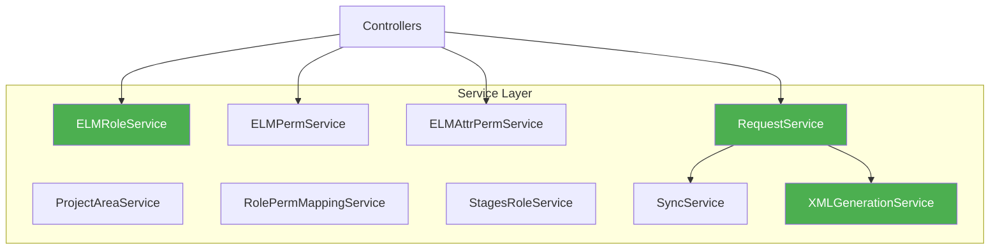
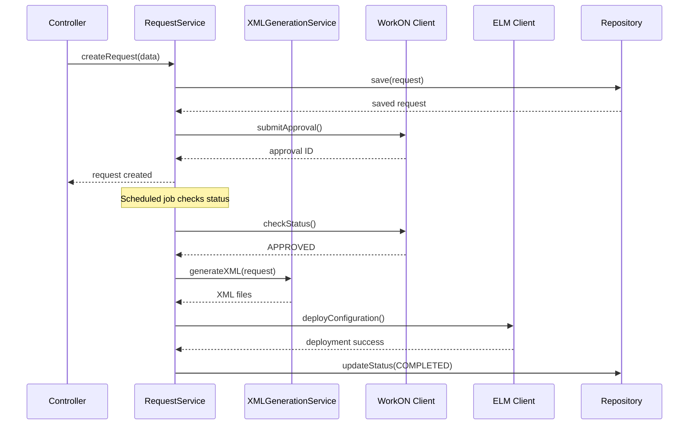
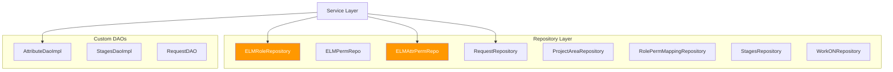
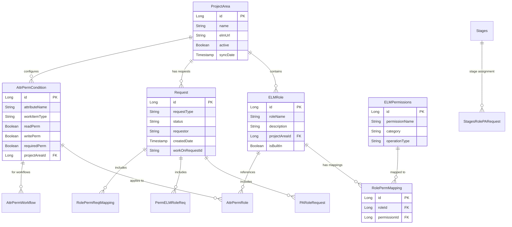
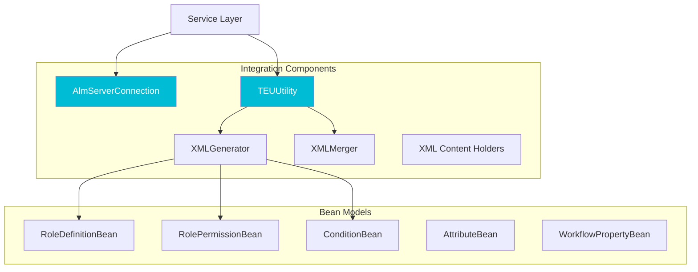
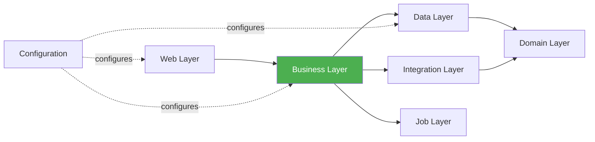

# 5. Building Block View

**General Purpose:** Decompose the system into modules, components, or services.

## 5.1 Whitebox Main Component

**General Purpose:** Detailed internal structure of the main EPC application.

### Level 0: System Context



### Level 1: Main Application Structure



### Component Responsibilities

| Component | Responsibility | Key Classes |
|-----------|---------------|-------------|
| **Web Layer** | • Handle HTTP requests<br>• Validate input<br>• Map requests to responses<br>• Exception handling | `*Controller` classes<br>`CsrfController`<br>`GlobalExceptionHandler` |
| **Business Layer** | • Business logic<br>• Transaction management<br>• Validation rules<br>• Orchestration | `*Service` and `*ServiceImpl` classes |
| **Data Access Layer** | • Database operations<br>• Query execution<br>• Data mapping | `*Repository` interfaces<br>`*DaoImpl` classes |
| **Domain Layer** | • Domain entities<br>• JPA mappings<br>• Entity relationships | `ELMRole`, `ELMPermissions`, `Request`, etc. |
| **Job Layer** | • Scheduled tasks<br>• Background processing<br>• Batch operations | `ELMDataSyncJob`<br>`ProcessRequestJob`<br>`WorkONStatusSyncJob` |
| **Integration Layer** | • External system integration<br>• API clients<br>• XML processing | `AlmServerConnection`<br>`TEUUtility`<br>`XMLGenerator`, `XMLMerger` |
| **Configuration** | • Spring configuration<br>• Security setup<br>• Bean definitions | `SecurityConfig`<br>`EPCApplication` (main class) |

## 5.2 Building Blocks - Level 2

### 5.2.1 Web Layer (Controller Module)

**General Purpose:** Handle REST API requests and responses.



#### Controller Components **(Project-Sourced)**

| Controller | Endpoints | Responsibility |
|------------|-----------|----------------|
| **ELMRoleController** | `/api/roles/*` | • Get all roles<br>• Create new role<br>• Update role<br>• Delete role<br>• Get roles by project area |
| **ELMPermController** | `/api/permissions/*` | • Get all permissions<br>• Create permission<br>• Update permission<br>• Delete permission<br>• Get permissions by category |
| **ELMAttrPermController** | `/api/attrperm/*` | • Get attribute permissions<br>• Save attribute condition<br>• Update attribute condition<br>• Delete attribute condition<br>• Bulk save<br>• Get attributes by work item type |
| **RequestController** | `/api/request/*` | • Create request<br>• Get request status<br>• Submit for approval<br>• Get request history<br>• Cancel request |
| **ProjectAreaController** | `/api/projectarea/*` | • Get all project areas<br>• Get project area details<br>• Sync project areas<br>• Check user access |
| **RolePermMappingController** | `/api/roleperm/*` | • Map role to permissions<br>• Get mappings<br>• Update mappings<br>• Delete mappings |
| **StagesMappingController** | `/api/stages/*` | • Map stages to roles<br>• Get stage mappings<br>• Update stage assignments |
| **UserController** | `/api/user/*` | • Get current user<br>• Get user roles<br>• LDAP user search |
| **JobController** | `/api/jobs/*` | • Trigger manual job execution<br>• Get job status<br>• View job history |
| **CsrfController** | `/api/csrf` | • Get CSRF token for clients |

### 5.2.2 Business Layer (Service Module)

**General Purpose:** Implement business logic and orchestration.



#### Service Components **(Project-Sourced)**

| Service | Responsibility | Key Methods |
|---------|---------------|-------------|
| **ELMRoleService** | Role management business logic | • createRole()<br>• updateRole()<br>• deleteRole()<br>• getRolesByProjectArea()<br>• validateRoleName() |
| **ELMPermService** | Permission management | • createPermission()<br>• updatePermission()<br>• getPermissionsByCategory()<br>• validatePermission() |
| **ELMAttrPermService** | Attribute permission logic | • saveAttrPermCondition()<br>• updateAttrPermCondition()<br>• bulkSaveConditions()<br>• getAttrPermsByProjectArea()<br>• validateAttributeExists() |
| **RequestService** | Request lifecycle management | • createRequest()<br>• submitForApproval()<br>• processRequest()<br>• updateStatus()<br>• generateConfiguration() |
| **ProjectAreaService** | Project area operations | • syncProjectAreas()<br>• getProjectAreaDetails()<br>• checkUserAccess()<br>• updateProjectAreaMetadata() |
| **RolePermMappingService** | Role-permission mapping | • mapRoleToPermissions()<br>• updateMappings()<br>• getMappingsByRole()<br>• validateMapping() |
| **StagesRoleService** | Stage-based role mapping | • mapStageToRoles()<br>• getStageAssignments()<br>• validateStageTransition() |
| **SyncService** | Data synchronization | • syncFromELM()<br>• syncWorkONStatus()<br>• reconcileData() |
| **XMLGenerationService** | XML configuration generation | • generateRoleXML()<br>• generatePermissionXML()<br>• generateConditionXML()<br>• mergeWithTemplate()<br>• validateXML() |

#### Service Layer Interactions



### 5.2.3 Data Access Layer (Repository Module)

**General Purpose:** Abstract database operations and provide query methods.



#### Repository Components **(Project-Sourced)**

| Repository | Entity | Key Methods |
|------------|--------|-------------|
| **ELMRoleRepository** | ELMRole | • findByProjectAreaName()<br>• findByRoleName()<br>• findByActiveTrue() |
| **ELMPermRepo** | ELMPermissions | • findByCategory()<br>• findByOperationName() |
| **ELMAttrPermRepo** | AttrPermCondition | • findByProjectAreaId()<br>• findByAttributeName()<br>• findByWorkItemType() |
| **RequestRepository** | Request | • findByStatus()<br>• findByRequestor()<br>• findByCreatedDateBetween()<br>• findByWorkOnRequestId() |
| **ProjectAreaRepository** | ProjectArea | • findByName()<br>• findByActiveTrue()<br>• findByElmUrl() |
| **RolePermMappingRepository** | RolePermMapping | • findByRoleId()<br>• findByPermissionId()<br>• deleteByRoleId() |
| **StagesRepository** | Stages | • findByStageName()<br>• findByProjectAreaId() |
| **WorkONRepository** | WorkONRequest | • findByRequestId()<br>• findByStatus() |

#### Custom DAO Implementations

| DAO | Purpose | Methods |
|-----|---------|---------|
| **AttributeDaoImpl** | Complex attribute queries | • getAttributesByWorkItemType()<br>• getAttributesWithPermissions()<br>• searchAttributes() |
| **StagesDaoImpl** | Stage hierarchy queries | • getStageHierarchy()<br>• getStagesByLevel()<br>• validateStageTransition() |
| **RequestDAO** | Complex request queries | • getRequestsWithDetails()<br>• getRequestHistory()<br>• getApprovalChain() |

### 5.2.4 Domain Layer (Entity Module)

**General Purpose:** Define data model and entity relationships.



#### Key Entities **(Project-Sourced)**

| Entity | Description | Key Attributes |
|--------|-------------|----------------|
| **ProjectArea** | ELM project area | • name<br>• elmUrl<br>• active<br>• syncDate |
| **ELMRole** | Role definition | • roleName<br>• description<br>• projectAreaId<br>• isBuiltIn |
| **ELMPermissions** | Permission definition | • permissionName<br>• category (TEAM_OPERATION, PROJECT_OPERATION)<br>• operationType |
| **RolePermMapping** | Role-permission association | • roleId<br>• permissionId |
| **AttrPermCondition** | Attribute permission rule | • attributeName<br>• workItemType<br>• readPerm, writePerm, requiredPerm<br>• projectAreaId |
| **AttrPermRole** | Roles for attribute condition | • attrPermConditionId<br>• roleId |
| **AttrPermWorkflow** | Workflow states for condition | • attrPermConditionId<br>• workflowStateId |
| **Request** | Configuration change request | • requestType<br>• status<br>• requestor<br>• workOnRequestId |
| **Stages** | Project lifecycle stages | • stageName (Concept, Development, Testing, Production)<br>• stageOrder |

### 5.2.5 Job Layer (Scheduled Tasks Module)

**General Purpose:** Execute background and scheduled tasks.

```mermaid
graph TB
    subgraph "Scheduled Jobs"
        SYNC_JOB[ELMDataSyncJob<br/>@Scheduled]
        PROC_JOB[ProcessRequestJob<br/>@Scheduled]
        STATUS_JOB[WorkONStatusSyncJob<br/>@Scheduled]
    end
    
    subgraph "Services"
        SYNC_SVC[SyncService]
        REQ_SVC[RequestService]
        XML_SVC[XMLGenerationService]
    end
    
    SYNC_JOB --> SYNC_SVC
    PROC_JOB --> REQ_SVC
    PROC_JOB --> XML_SVC
    STATUS_JOB --> REQ_SVC
    
    style SYNC_JOB fill:#9C27B0,color:#fff
    style PROC_JOB fill:#9C27B0,color:#fff
```

#### Job Components **(Project-Sourced)**

| Job | Schedule | Purpose | Actions |
|-----|----------|---------|---------|
| **ELMDataSyncJob** | Configurable cron<br/>(e.g., daily 2 AM) | Sync project areas from ELM | • Fetch project areas from ELM<br>• Update local database<br>• Fetch work item types<br>• Fetch workflow definitions<br>• Update metadata |
| **ProcessRequestJob** | Every 15 minutes **(AI-Generated Placeholder)** | Process approved requests | • Find requests with status=APPROVED<br>• Generate XML configurations<br>• Validate XML<br>• Deploy to ELM<br>• Update status to COMPLETED/FAILED |
| **WorkONStatusSyncJob** | Every 15 minutes **(AI-Generated Placeholder)** | Sync WorkON request status | • Find requests with status=PENDING<br>• Query WorkON API for status<br>• Update local request status<br>• Trigger processing if approved |

### 5.2.6 Integration Layer (External System Clients)

**General Purpose:** Integrate with external systems.



#### Integration Components **(Project-Sourced from com.bosch.rtc package)**

| Component | Purpose | Key Methods |
|-----------|---------|-------------|
| **AlmServerConnection** | Connect to ELM server | • connect(url, username, password)<br>• fetchProjectAreas()<br>• fetchWorkItemTypes()<br>• getWorkflowStates() |
| **TEUUtility** | Template Exchange operations | • uploadConfiguration(xml)<br>• downloadTemplate()<br>• validateConfiguration() |
| **XMLGenerator** | Generate XML from data | • generateRoleDefinitions(roles)<br>• generatePermissions(permissions)<br>• generateConditions(conditions) |
| **XMLMerger** | Merge XML files | • mergeRoles(baseXml, newXml)<br>• mergePermissions(baseXml, newXml)<br>• validateMergedXml() |
| **RoleXMLContentHolder** | Hold role XML content | • addRole(roleBean)<br>• toXML() |
| **PermXMLContentHolder** | Hold permission XML content | • addPermission(permBean)<br>• toXML() |
| **ConditionXMLContentHolder** | Hold condition XML content | • addCondition(condBean)<br>• toXML() |

#### XML Bean Classes **(Project-Sourced)**

JAXB-annotated beans for XML marshalling:

- **RoleDefinitionBean**: Role structure
- **RoleBean**: Individual role
- **RolePermissionBean**: Permission structure
- **TeamOperationBean**: Team operation permissions
- **ProjectOperationBean**: Project operation permissions
- **ConditionBean**: Attribute condition structure
- **AttributeBean**: Attribute properties
- **WorkflowPropertyBean**: Workflow state properties
- **ActionBean**: Permission actions (Read, Write, Execute)

### 5.2.7 Configuration Module

**General Purpose:** Spring configuration and application setup.

```mermaid
graph TB
    subgraph "Configuration"
        MAIN[EPCApplication<br/>@SpringBootApplication]
        SEC[SecurityConfig<br/>@Configuration]
        CACHE[Cache Configuration<br/>ehcache.xml]
        PROPS[application.properties]
    end
    
    MAIN --> SEC
    MAIN --> CACHE
    MAIN --> PROPS
    
    style MAIN fill:#673AB7,color:#fff
    style SEC fill:#673AB7,color:#fff
```

#### Configuration Components **(Project-Sourced)**

| Component | Purpose | Configuration |
|-----------|---------|---------------|
| **EPCApplication** | Main entry point | • @SpringBootApplication<br>• @EnableScheduling<br>• @EnableCaching<br>• Component scan configuration |
| **SecurityConfig** | Security configuration | • LDAP authentication<br>• CSRF protection<br>• Role-based authorization<br>• Session management |
| **application.properties** | Application properties | • Database connection<br>• Server port<br>• Logging levels<br>• ELM URLs |
| **ehcache.xml** | Cache configuration | • Cache regions<br>• TTL settings<br>• Eviction policies |

## Component Dependencies



**Dependency Rules:**
- **Web** depends on **Business** (not Data directly)
- **Business** depends on **Data** and **Integration**
- **Data** depends on **Domain**
- **Jobs** depend on **Business** (not Data directly)
- **No circular dependencies**
- **Domain** has minimal dependencies (only JPA annotations)
