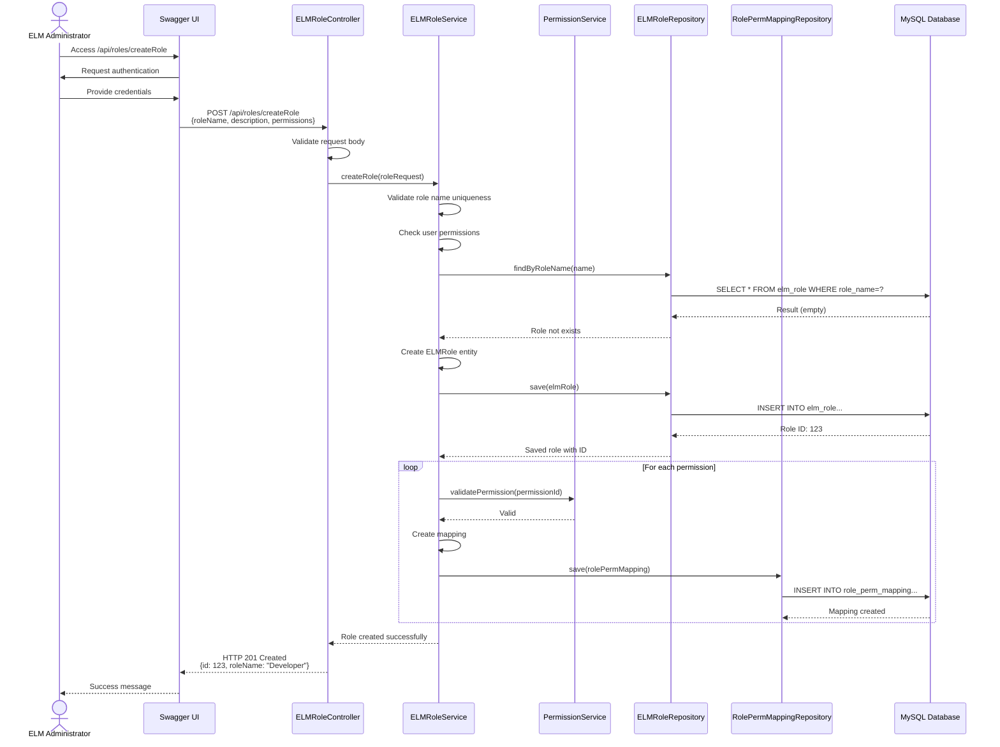
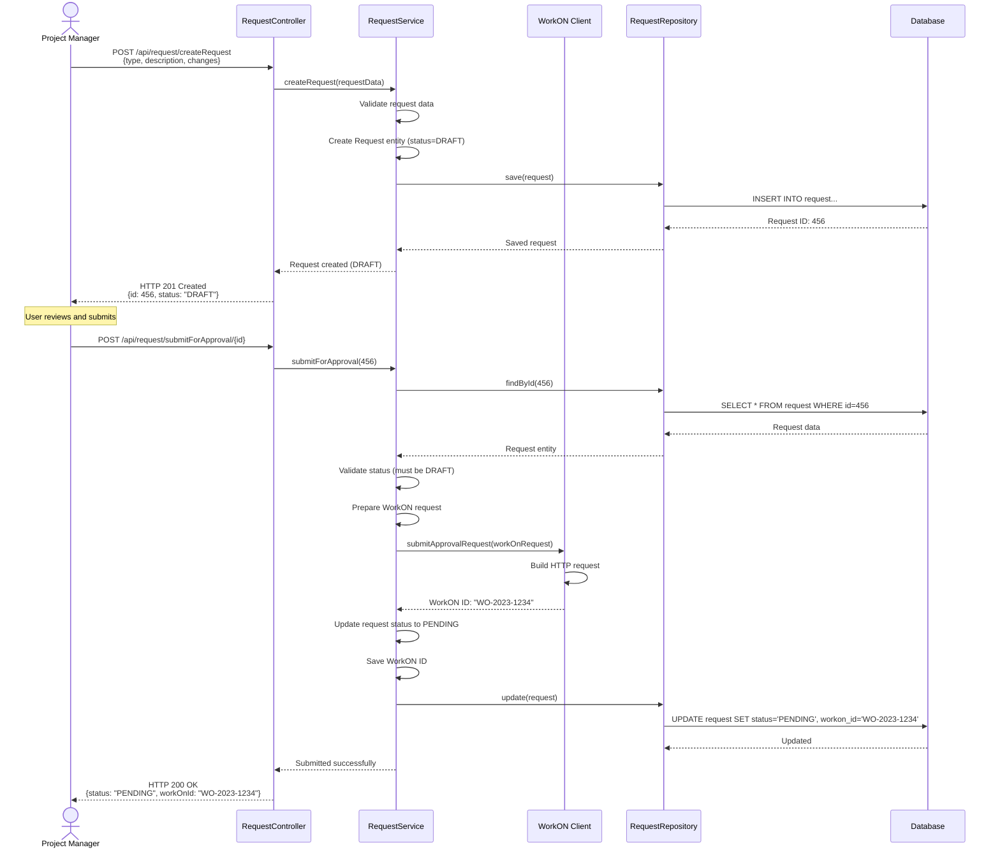
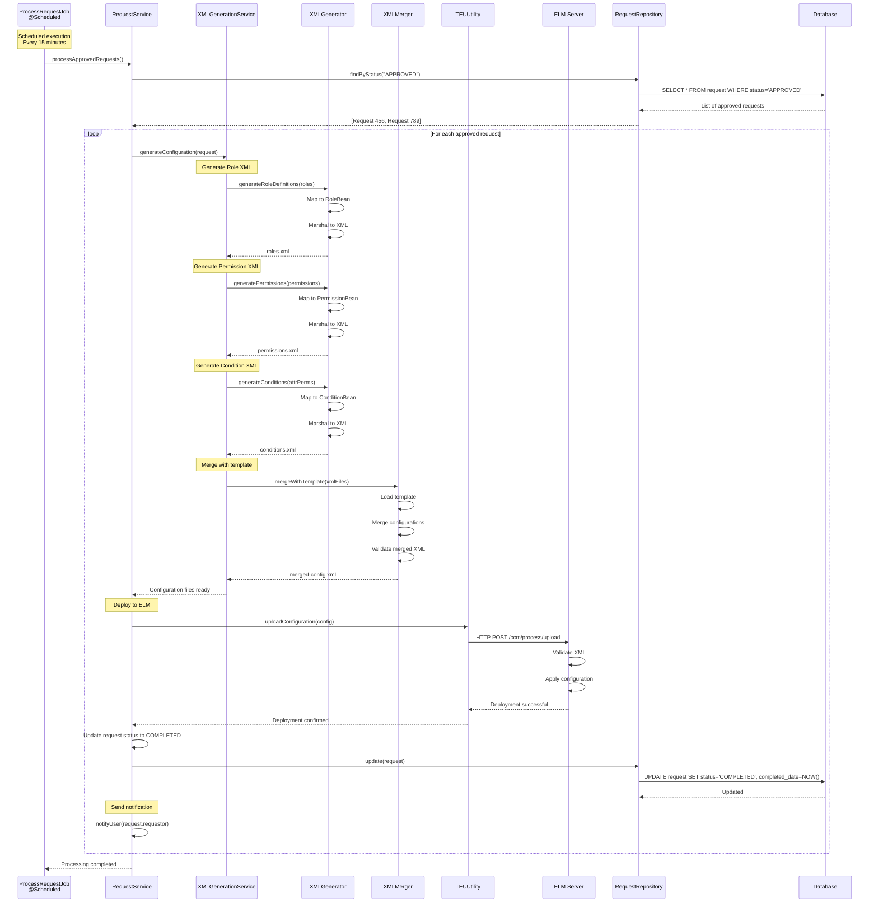
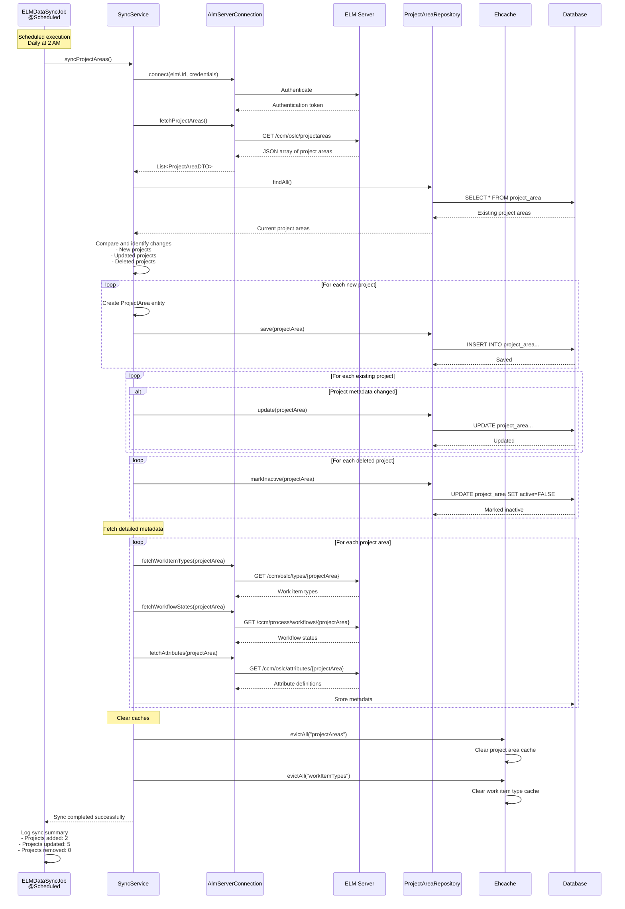
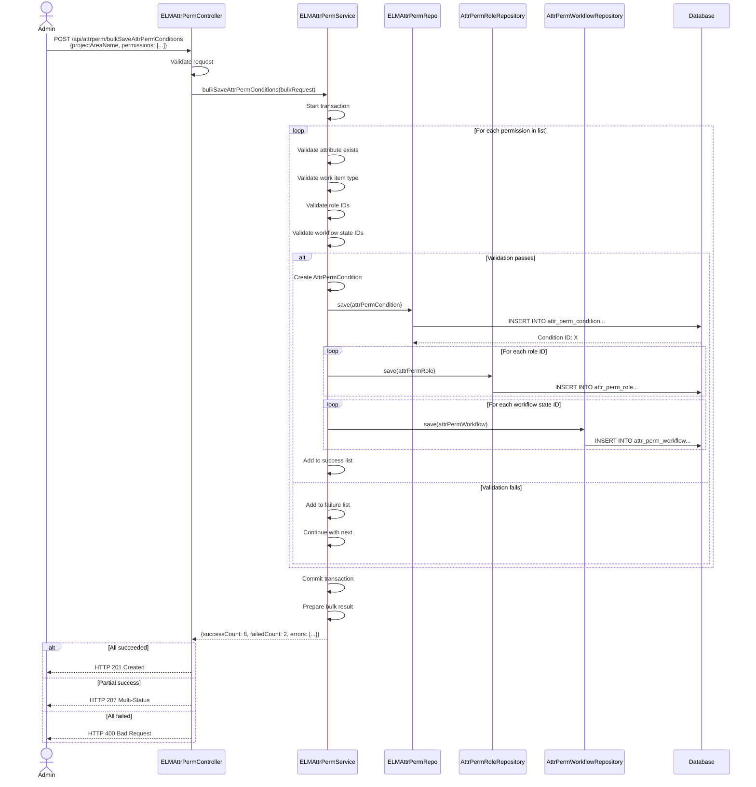

# 6. Runtime View

**General Purpose:** Describe dynamic behavior using sequences or use cases.

## 6.1 Use Case: Create Role Configuration

**Purpose:** Administrator creates a new role with permissions and attribute controls.

### Sequence Diagram

### Runtime Behavior

1. **Authentication Phase**
   - User credentials validated against LDAP
   - Session token created
   - User authorities loaded (ADMIN, USER, etc.)

2. **Validation Phase**
   - Request body validated (null checks, format)
   - Role name uniqueness checked
   - Permission IDs validated
   - User authorization verified

3. **Persistence Phase**
   - Transaction started (@Transactional)
   - Role entity saved to database
   - Role-permission mappings created
   - Transaction committed

4. **Response Phase**
   - Success response generated
   - HTTP 201 Created returned
   - Response includes created role details

## 6.2 Use Case: Submit Configuration Request for Approval

**Purpose:** User submits a configuration change request that goes through WorkON approval workflow.

### Sequence Diagram

### Runtime Behavior

1. **Draft Creation**
   - Request created with status DRAFT
   - Changes stored in database
   - User can edit before submitting

2. **Submission**
   - Request validated
   - WorkON approval request created
   - Request status changed to PENDING
   - WorkON ID stored for tracking

3. **Approval Tracking**
   - Background job polls WorkON status
   - Status updated automatically
   - User notified of approval/rejection

## 6.3 Use Case: Process Approved Request (Background Job)

**Purpose:** Scheduled job processes approved requests and deploys configurations to ELM.

### Sequence Diagram

### Runtime Behavior

1. **Job Trigger**
   - Spring scheduler triggers at configured interval
   - Job acquires lock to prevent concurrent execution **(AI-Generated Placeholder)**

2. **Request Discovery**
   - Query database for approved requests
   - Sort by priority and creation date

3. **XML Generation**
   - Fetch related data (roles, permissions, attributes)
   - Map to JAXB beans
   - Marshal to XML files
   - Validate XML structure

4. **Template Merging**
   - Load base process template from ELM
   - Merge new configurations
   - Validate merged result
   - Ensure no conflicts

5. **Deployment**
   - Upload to ELM server via TEU
   - ELM validates and applies
   - Confirmation received

6. **Status Update**
   - Mark request as COMPLETED
   - Record completion timestamp
   - Update WorkON system
   - Notify requestor

7. **Error Handling**
   - If any step fails, mark as FAILED
   - Log error details
   - Notify administrator
   - Request can be retried manually

## 6.4 Use Case: Synchronize Project Areas from ELM

**Purpose:** Scheduled job keeps project area data in sync with ELM server.

### Sequence Diagram

### Runtime Behavior

1. **Connection Phase**
   - Authenticate to ELM server
   - Obtain session token
   - Handle connection failures with retry

2. **Data Fetch Phase**
   - Fetch project area list
   - Fetch work item types
   - Fetch workflow definitions
   - Fetch attribute definitions

3. **Comparison Phase**
   - Compare with local database
   - Identify new, updated, deleted projects
   - Calculate delta changes

4. **Update Phase**
   - Insert new projects
   - Update changed projects
   - Mark deleted projects as inactive (soft delete)
   - Store metadata

5. **Cache Management**
   - Evict cached project area data
   - Force cache refresh on next access

6. **Completion**
   - Log sync summary
   - Record sync timestamp
   - Report errors if any

## 6.5 Use Case: Bulk Save Attribute Permissions

**Purpose:** Administrator saves multiple attribute permissions in a single operation for efficiency.

### Sequence Diagram

### Runtime Behavior

1. **Bulk Request Reception**
   - Receive array of attribute permissions
   - Validate overall request structure

2. **Transaction Management**
   - Start single database transaction
   - Process all items within transaction
   - Rollback if critical error **(AI-Generated Placeholder)**

3. **Individual Processing**
   - Validate each permission independently
   - Continue processing even if some fail
   - Track success/failure counts

4. **Batch Persistence**
   - Use JPA batch operations for efficiency
   - Reduce database round trips
   - Improve performance for large batches

5. **Result Aggregation**
   - Collect successful IDs
   - Collect error messages
   - Return comprehensive result

6. **Response Strategy**
   - 201 Created: All succeeded
   - 207 Multi-Status: Partial success
   - 400 Bad Request: All failed

## 6.6 Runtime Constraints

| Constraint | Description | Impact |
|------------|-------------|--------|
| **Transaction Timeout** | 30 seconds per transaction **(AI-Generated Placeholder)** | Long-running operations may need splitting |
| **Session Timeout** | 30 minutes inactivity **(AI-Generated Placeholder)** | User must re-authenticate |
| **Job Concurrency** | Jobs run sequentially, not concurrently | Prevents data conflicts |
| **Database Connection Pool** | 10 connections max **(AI-Generated Placeholder)** | Limits concurrent operations |
| **XML File Size** | Max 10MB per configuration **(AI-Generated Placeholder)** | Very large projects may need optimization |
| **Bulk Operation Size** | Max 100 items per bulk request **(AI-Generated Placeholder)** | Prevents memory issues |

## 6.7 Performance Considerations

| Scenario | Optimization | Expected Performance |
|----------|--------------|---------------------|
| **Frequent Project Area Queries** | Ehcache with 1-hour TTL **(AI-Generated Placeholder)** | < 50ms response time |
| **Bulk Attribute Save** | JPA batch processing | < 10 seconds for 100 items **(AI-Generated Placeholder)** |
| **Request Processing** | Background job, non-blocking | No user wait time |
| **ELM Sync** | Scheduled off-peak hours | No business hour impact |
| **Database Queries** | Indexed foreign keys | < 100ms for most queries **(AI-Generated Placeholder)** |
