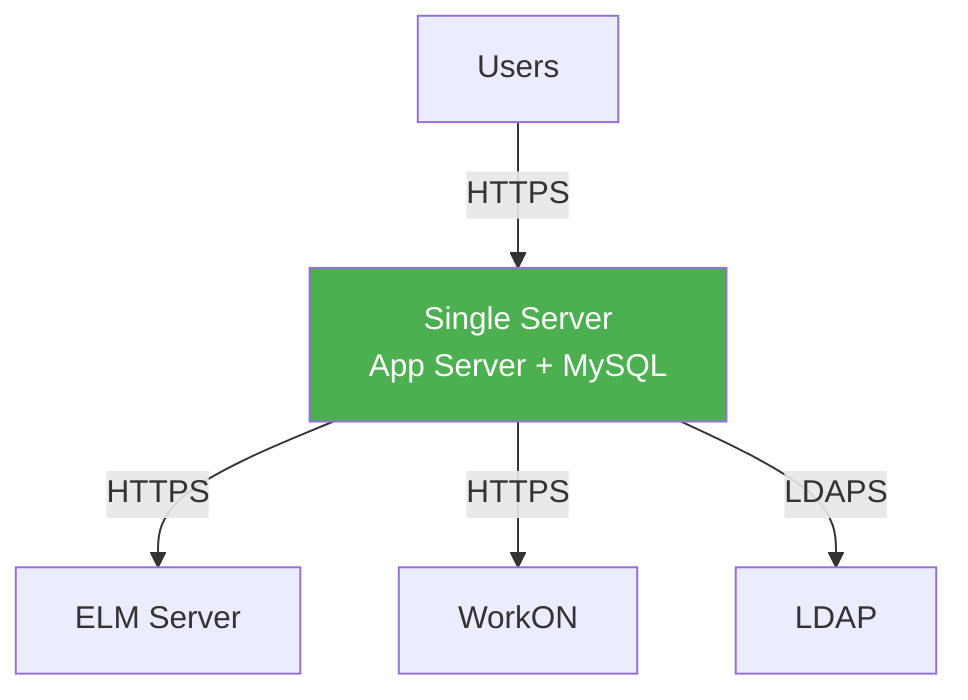
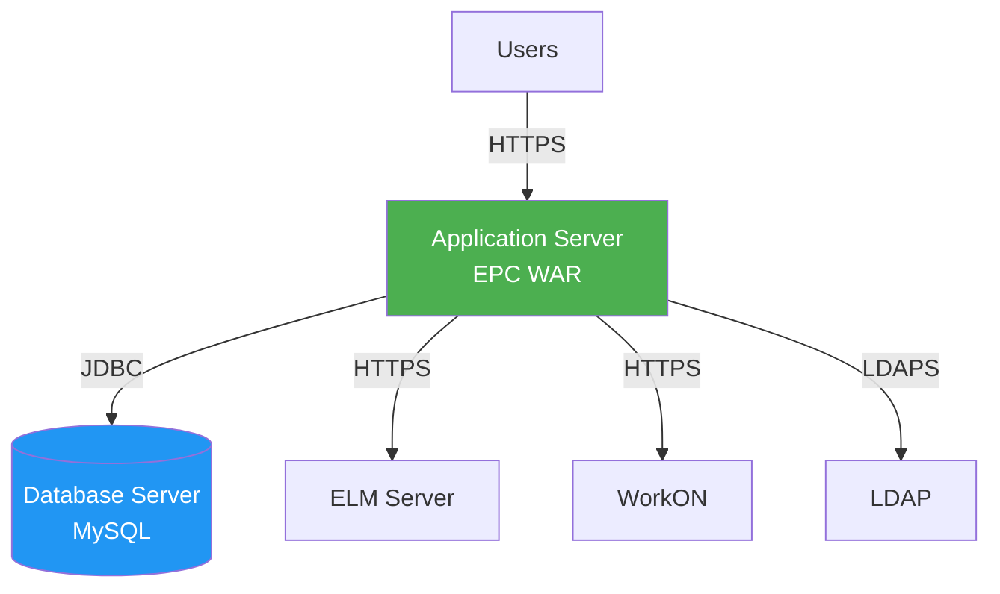
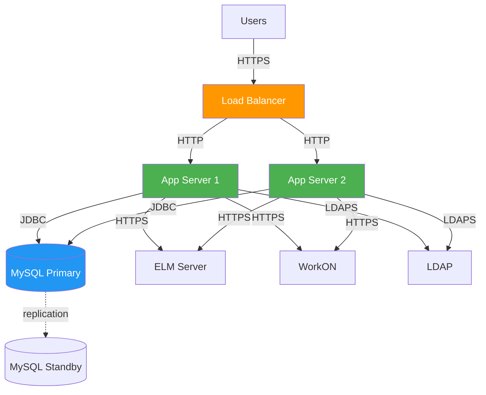

# 7. Deployment View

**General Purpose:** Map software components onto hardware / deployment nodes.

## 7.1 Infrastructure Overview

```mermaid
graph TB
    subgraph "Client Zone"
        BROWSER[Web Browser<br/>Windows/Mac/Linux]
        API_CLIENT[API Client<br/>Postman/Scripts]
    end
    
    subgraph "DMZ / Application Zone"
        LB[Load Balancer<br/>**[If applicable]**]
        APP1[Application Server 1<br/>Tomcat/WebSphere<br/>EPC WAR]
        APP2[Application Server 2<br/>**[Optional]**<br/>EPC WAR]
    end
    
    subgraph "Data Zone"
        DB_PRIMARY[(MySQL Primary<br/>bp0vm025:3306<br/>epc database)]
        DB_BACKUP[(MySQL Backup<br/>**[If applicable]**)]
    end
    
    subgraph "External Services Zone"
        ELM_SRV[ELM Server<br/>IBM Engineering<br/>Lifecycle Management]
        WORKON_SRV[WorkON System<br/>Approval Workflow]
        LDAP_SRV[LDAP Server<br/>Bosch Active Directory]
    end
    
    BROWSER -->|HTTPS:443| LB
    API_CLIENT -->|HTTPS:443| LB
    LB -->|HTTP:8080| APP1
    LB -->|HTTP:8080| APP2
    
    APP1 -->|JDBC:3306| DB_PRIMARY
    APP2 -->|JDBC:3306| DB_PRIMARY
    
    DB_PRIMARY -.replication.-> DB_BACKUP
    
    APP1 -->|HTTPS:443| ELM_SRV
    APP1 -->|HTTPS:443| WORKON_SRV
    APP1 -->|LDAPS:636| LDAP_SRV
    
    style APP1 fill:#4CAF50,color:#fff
    style DB_PRIMARY fill:#2196F3,color:#fff
    style LB fill:#FF9800,color:#fff
```

## 7.2 Deployment Nodes

### Node 1: Application Server

**Purpose:** Hosts the EPC web application

| Property | Value |
|----------|-------|
| **Server Type** | Apache Tomcat 9.x or IBM WebSphere **(AI-Generated Placeholder)** |
| **Operating System** | Linux (RHEL/CentOS) or Windows Server **(AI-Generated Placeholder)** |
| **Java Version** | Java 9+ JDK **(Project-Sourced)** |
| **Memory** | 4 GB RAM minimum, 8 GB recommended **(AI-Generated Placeholder)** |
| **CPU** | 4 cores minimum **(AI-Generated Placeholder)** |
| **Disk Space** | 10 GB minimum **(AI-Generated Placeholder)** |
| **Network** | Gigabit Ethernet |
| **Deployment Package** | epc.war **(Project-Sourced from target/)** |

**Installed Components:**
- Java Runtime Environment (JRE) 9+
- Application Server (Tomcat/WebSphere)
- EPC WAR file
- Configuration files (external to WAR)
- Log directory (writable)

**Configuration Files:**
```
/opt/epc/config/
├── application.properties    # Database, ELM URLs
├── application-prod.properties  # Production overrides
├── ehcache.xml               # Cache configuration
└── logback.xml               # Logging configuration
```

**Environment Variables:**
```bash
export JAVA_HOME=/usr/lib/jvm/java-9-openjdk
export EPC_DB_URL=jdbc:mysql://bp0vm025.emea.bosch.com:3306/epc
export EPC_DB_USERNAME=tooldatabase
export EPC_DB_PASSWORD=***encrypted***
export EPC_LDAP_URL=ldaps://ldap.bosch.com:636
export EPC_ELM_URL=https://elm.bosch.com/ccm
export CATALINA_OPTS="-Xms2048m -Xmx4096m -XX:MaxPermSize=512m"
```

### Node 2: Database Server

**Purpose:** MySQL database for EPC data storage

| Property | Value |
|----------|-------|
| **Server** | bp0vm025.emea.bosch.com **(Project-Sourced)** |
| **Database Engine** | MySQL 5.7+ or 8.0+ |
| **Operating System** | Linux (RHEL/CentOS) **(AI-Generated Placeholder)** |
| **Port** | 3306 **(Project-Sourced)** |
| **Database Name** | epc **(Project-Sourced)** |
| **Memory** | 8 GB RAM minimum **(AI-Generated Placeholder)** |
| **Storage** | 100 GB minimum, SSD preferred **(AI-Generated Placeholder)** |
| **Backup** | Daily full backup, transaction log backup **(AI-Generated Placeholder)** |

**Database Configuration:**
```ini
[mysqld]
max_connections = 100
innodb_buffer_pool_size = 4G
innodb_log_file_size = 512M
character_set_server = utf8mb4
collation_server = utf8mb4_unicode_ci
max_allowed_packet = 64M
```

**Database Objects:**
- Tables: ~20+ tables **(AI-Generated Placeholder)**
- Views: **[Number required – please provide]**
- Stored Procedures: **[Number required – please provide]**
- Indexes: Primary keys, foreign keys, search indexes
- Size: ~5-50 GB depending on usage **(AI-Generated Placeholder)**

### Node 3: ELM Server (External)

**Purpose:** Engineering Lifecycle Management system

| Property | Value |
|----------|-------|
| **Vendor** | IBM (formerly part of Jazz/RTC) |
| **Server URL** | https://elm.bosch.com/ccm **(Project-Sourced URL pattern)** |
| **Port** | 443 (HTTPS) |
| **Authentication** | Basic Auth or OAuth **(AI-Generated Placeholder)** |
| **API Version** | ELM 7.x REST API **(AI-Generated Placeholder)** |

**EPC Integration:**
- REST API for metadata retrieval
- Template Exchange Utility for configuration deployment
- Process template management
- Work item type and workflow queries

### Node 4: WorkON Server (External)

**Purpose:** Approval workflow management system

| Property | Value |
|----------|-------|
| **Protocol** | HTTPS REST API |
| **Port** | 443 |
| **Authentication** | API Key or Service Account **(AI-Generated Placeholder)** |
| **Data Format** | JSON **(Project-Sourced)** |

**EPC Integration:**
- Submit approval requests
- Query request status
- Receive approval notifications
- Update completion status

### Node 5: LDAP Server (External)

**Purpose:** User authentication and directory services

| Property | Value |
|----------|-------|
| **Server** | Bosch Active Directory **(AI-Generated Placeholder)** |
| **Protocol** | LDAPS (LDAP over SSL) **(Project-Sourced)** |
| **Port** | 636 **(AI-Generated Placeholder)** |
| **Base DN** | **[Provide LDAP base DN]** |
| **User DN Pattern** | uid={0},ou=people,dc=bosch,dc=com **(AI-Generated Placeholder)** |

**EPC Integration:**
- User authentication
- User attribute retrieval
- Group membership queries
- Role mapping

## 7.3 Deployment Architecture Variants

### Variant 1: Single Server Deployment (Development/Test)



**Characteristics:**
- Simple setup for development/testing
- Application and database on same server
- Lower resource requirements
- Not recommended for production

**Resource Requirements:**
- 8 GB RAM
- 4 CPU cores
- 100 GB disk space

### Variant 2: Two-Tier Deployment (Production)



**Characteristics:**
- Separate app and database servers
- Better performance and scalability
- Easier maintenance and upgrades
- **Recommended for production** **(Project-Sourced deployment model)**

**Resource Requirements:**
- App Server: 4-8 GB RAM, 4 cores
- DB Server: 8-16 GB RAM, 4-8 cores

### Variant 3: High Availability Deployment (Enterprise)



**Characteristics:**
- Load balanced application servers
- Database replication for failover
- High availability and scalability
- Zero-downtime deployments possible
- **Optional for high-traffic environments**

**Resource Requirements:**
- 2+ App Servers: 4-8 GB RAM each
- Primary DB: 16 GB RAM, 8 cores
- Standby DB: Same as primary
- Load Balancer: Hardware or software (HAProxy, nginx)

## 7.4 Network Architecture

### Network Zones and Security

```mermaid
graph TB
    subgraph "Internet"
        EXTERNAL[External Users<br/>**[If applicable]**]
    end
    
    subgraph "Corporate Network"
        INTERNAL[Internal Users]
    end
    
    subgraph "DMZ"
        FIREWALL1[Firewall 1]
        LB[Load Balancer]
    end
    
    subgraph "Application Zone"
        FIREWALL2[Firewall 2]
        APP[Application Servers]
    end
    
    subgraph "Data Zone"
        FIREWALL3[Firewall 3]
        DB[(Database)]
    end
    
    subgraph "External Services"
        ELM[ELM Server]
        WORKON[WorkON]
        LDAP[LDAP]
    end
    
    EXTERNAL -->|HTTPS:443| FIREWALL1
    INTERNAL -->|HTTPS:443| FIREWALL1
    FIREWALL1 --> LB
    LB -->|HTTP:8080| FIREWALL2
    FIREWALL2 --> APP
    APP -->|JDBC:3306| FIREWALL3
    FIREWALL3 --> DB
    
    APP -->|HTTPS:443| ELM
    APP -->|HTTPS:443| WORKON
    APP -->|LDAPS:636| LDAP
```

### Firewall Rules

#### Firewall 1 (External → DMZ)

| Source | Destination | Port | Protocol | Purpose |
|--------|------------|------|----------|---------|
| Any | Load Balancer | 443 | HTTPS | Web access |
| Any | Load Balancer | 80 | HTTP | Redirect to HTTPS |

#### Firewall 2 (DMZ → Application Zone)

| Source | Destination | Port | Protocol | Purpose |
|--------|------------|------|----------|---------|
| Load Balancer | App Servers | 8080 | HTTP | Application traffic |
| Load Balancer | App Servers | 8443 | HTTPS | Secure application traffic |

#### Firewall 3 (Application → Data Zone)

| Source | Destination | Port | Protocol | Purpose |
|--------|------------|------|----------|---------|
| App Servers | MySQL | 3306 | JDBC/MySQL | Database access |

#### Firewall 4 (Application → External Services)

| Source | Destination | Port | Protocol | Purpose |
|--------|------------|------|----------|---------|
| App Servers | ELM Server | 443 | HTTPS | ELM integration |
| App Servers | WorkON | 443 | HTTPS | WorkON integration |
| App Servers | LDAP | 636 | LDAPS | Authentication |

## 7.5 Deployment Process

### Step 1: Pre-Deployment Checklist

- [ ] Database backup completed
- [ ] Database schema updated (if required)
- [ ] Configuration files prepared
- [ ] Environment variables configured
- [ ] SSL certificates installed
- [ ] Firewall rules configured
- [ ] External service connectivity tested

### Step 2: Build Process

```bash
# Navigate to project directory
cd /path/to/EPC

# Clean and build with Maven
mvn clean install -DskipTests=false

# Verify WAR file created
ls -lh target/epc.war
```

**Build Output:**
- `target/epc.war` - Deployable WAR file **(Project-Sourced)**
- `target/epc.war.original` - Original WAR before Spring Boot repackaging
- Build logs

### Step 3: Deployment to Application Server

#### Option A: Tomcat Deployment

```bash
# Stop Tomcat
sudo systemctl stop tomcat

# Backup existing deployment
sudo mv /opt/tomcat/webapps/epc /opt/tomcat/webapps/epc.backup

# Deploy new WAR
sudo cp target/epc.war /opt/tomcat/webapps/

# Set permissions
sudo chown tomcat:tomcat /opt/tomcat/webapps/epc.war

# Start Tomcat
sudo systemctl start tomcat

# Verify deployment
tail -f /opt/tomcat/logs/catalina.out
```

#### Option B: WebSphere Deployment

```bash
# Using wsadmin script
/opt/IBM/WebSphere/AppServer/bin/wsadmin.sh -lang jython

# In wsadmin console
AdminApp.install('/path/to/epc.war', '[-appname EPC -contextroot /epc]')
AdminConfig.save()
AdminControl.invoke('WebSphere:name=ApplicationManager,*', 'startApplication', 'EPC')
```

### Step 4: Post-Deployment Verification

```bash
# Check application logs
tail -f /var/log/epc/application.log

# Verify health endpoint
curl http://localhost:8080/epc/actuator/health

# Expected response: {"status":"UP"}

# Test LDAP connectivity
curl -X POST http://localhost:8080/epc/api/user/login \
  -H "Content-Type: application/json" \
  -d '{"username":"testuser","password":"***"}'

# Test database connectivity
curl http://localhost:8080/epc/api/projectarea/getProjectAreas

# Access Swagger UI
curl http://localhost:8080/epc/swagger-ui.html
```

### Step 5: Smoke Testing

1. **Authentication Test**
   - Login with LDAP credentials
   - Verify session created
   - Verify user roles loaded

2. **API Test**
   - Get project areas
   - Get roles
   - Get permissions

3. **Integration Test**
   - Connect to ELM server
   - Fetch project metadata
   - Verify database queries

4. **Scheduled Jobs Test**
   - Trigger manual sync job
   - Verify completion
   - Check logs for errors

## 7.6 Monitoring and Logging

### Application Logs

```
/var/log/epc/
├── application.log         # Application logs
├── error.log              # Error logs only
├── access.log             # HTTP access logs
├── audit.log              # Audit trail
└── performance.log        # Performance metrics
```

**Log Rotation:**
- Daily rotation
- Keep 30 days **(AI-Generated Placeholder)**
- Compress after 7 days **(AI-Generated Placeholder)**

### Monitoring Endpoints

| Endpoint | Purpose | Access |
|----------|---------|--------|
| `/actuator/health` | Application health status | Public |
| `/actuator/metrics` | Application metrics | Admin only |
| `/actuator/info` | Application info | Public |
| `/actuator/loggers` | Logger configuration | Admin only |

### Key Metrics to Monitor

- **Application Metrics:**
  - Request rate (requests/sec)
  - Response time (avg, p95, p99)
  - Error rate (%)
  - Active sessions

- **Database Metrics:**
  - Connection pool usage
  - Query execution time
  - Slow queries
  - Database size

- **System Metrics:**
  - CPU usage (%)
  - Memory usage (%)
  - Disk I/O
  - Network traffic

- **Integration Metrics:**
  - ELM server response time
  - WorkON API availability
  - LDAP authentication time

## 7.7 Backup and Recovery

### Backup Strategy

| Component | Frequency | Retention | Method |
|-----------|-----------|-----------|--------|
| **Database** | Daily full, hourly incremental | 30 days full, 7 days incremental **(AI-Generated Placeholder)** | mysqldump, binary logs |
| **Configuration Files** | Weekly | 90 days **(AI-Generated Placeholder)** | File system backup |
| **Application Logs** | Daily | 30 days **(AI-Generated Placeholder)** | Log archival |
| **WAR Files** | Each deployment | All versions **(AI-Generated Placeholder)** | Artifact repository |

### Database Backup Script

```bash
#!/bin/bash
# backup-epc-db.sh

DATE=$(date +%Y%m%d_%H%M%S)
BACKUP_DIR="/backup/epc/db"
DB_NAME="epc"
DB_USER="backup_user"
DB_HOST="bp0vm025.emea.bosch.com"

# Full backup
mysqldump -h $DB_HOST -u $DB_USER -p \
  --single-transaction \
  --routines \
  --triggers \
  --events \
  $DB_NAME > $BACKUP_DIR/epc_$DATE.sql

# Compress
gzip $BACKUP_DIR/epc_$DATE.sql

# Delete old backups (older than 30 days)
find $BACKUP_DIR -name "epc_*.sql.gz" -mtime +30 -delete
```

### Recovery Procedure

**Database Recovery:**
```bash
# Stop application
sudo systemctl stop tomcat

# Restore database
gunzip < /backup/epc/db/epc_20231215_020000.sql.gz | \
  mysql -h bp0vm025.emea.bosch.com -u tooldatabase -p epc

# Start application
sudo systemctl start tomcat
```

**Application Rollback:**
```bash
# Stop Tomcat
sudo systemctl stop tomcat

# Remove current deployment
sudo rm -rf /opt/tomcat/webapps/epc*

# Deploy previous version
sudo cp /backup/epc/war/epc-previous.war /opt/tomcat/webapps/epc.war

# Start Tomcat
sudo systemctl start tomcat
```

## 7.8 Scalability Considerations

| Aspect | Current Capacity | Scale-Up Strategy | Scale-Out Strategy |
|--------|-----------------|-------------------|-------------------|
| **Users** | 100 concurrent **(AI-Generated Placeholder)** | Increase app server RAM | Add more app servers |
| **Project Areas** | 50 projects **(AI-Generated Placeholder)** | Database optimization | Partition by project |
| **Requests/sec** | **[Number required – please provide]** | Increase CPU cores | Load balancing |
| **Database Size** | 50 GB **(AI-Generated Placeholder)** | Add storage | Database sharding **(future)** |
| **Cache Size** | 1 GB **(AI-Generated Placeholder)** | Increase heap size | Distributed cache (Redis) **(future)** |
