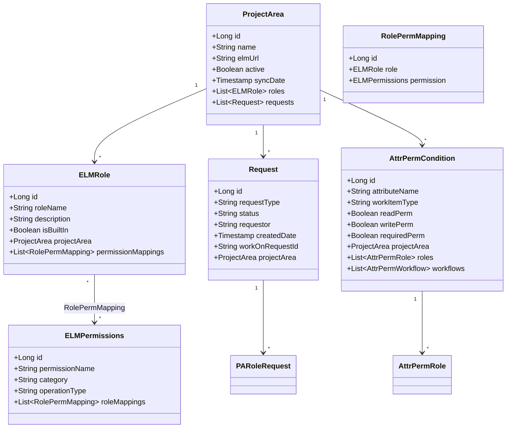

# 8. Concepts

**General Purpose:** Common technical principles, rules, and patterns across the system.

## 8.1 Domain Models

**General Purpose:** Core business entities and their relationships.

### Domain Model Overview

The EPC domain model consists of several key business entities organized around permission management for ELM systems.



### Domain Entity Descriptions

#### Project Area
**Purpose:** Represents an ELM project area that requires permission configuration.

**Business Rules:**
- Each project area has a unique name
- Must have a valid ELM server URL
- Can be marked inactive without deletion (soft delete)
- Synchronized periodically from ELM server

#### ELM Role
**Purpose:** Defines a role that can be assigned to users in ELM projects.

**Business Rules:**
- Role names must be unique within a project area
- Built-in roles cannot be deleted
- Roles can be mapped to multiple permissions
- Custom roles can be created by administrators

#### ELM Permission
**Purpose:** Defines a specific permission action in ELM (e.g., "Modify Work Items").

**Categories:**
- TEAM_OPERATION: Team-level operations
- PROJECT_OPERATION: Project-level operations
- PROCESS_OPERATION: Process configuration operations **(AI-Generated Placeholder)**

**Business Rules:**
- Permissions are system-wide (not project-specific)
- Permissions can be mapped to multiple roles
- Permission operations align with ELM's security model

#### Role-Permission Mapping
**Purpose:** Associates roles with permissions (many-to-many relationship).

**Business Rules:**
- A role can have multiple permissions
- A permission can be assigned to multiple roles
- Mappings are validated before deployment

#### Attribute Permission Condition
**Purpose:** Controls read/write/required access to work item attributes based on roles and workflow states.

**Business Rules:**
- Applies to specific work item types (Defect, Task, Story, etc.)
- Can be role-specific
- Can be workflow-state-specific
- Combinations define when attribute is readable/writable/required

#### Request
**Purpose:** Represents a configuration change request that requires approval.

**Status Values:**
- DRAFT: Created but not submitted
- PENDING: Submitted, awaiting approval
- APPROVED: Approved, ready for processing
- REJECTED: Rejected by approver
- IN_PROGRESS: Being processed
- COMPLETED: Successfully deployed
- FAILED: Deployment failed

**Business Rules:**
- Requests must go through WorkON approval
- Only approved requests are processed
- Failed requests can be retried
- Completed requests are archived

## 8.2 Persistency

**General Purpose:** Data storage and retrieval strategies.

### Database Schema Design

#### Naming Conventions

| Element | Convention | Example |
|---------|-----------|---------|
| Table names | snake_case, singular or plural | `elm_role`, `project_area` |
| Column names | snake_case | `role_name`, `created_date` |
| Primary keys | `id` (Long) | `id` |
| Foreign keys | `{table}_id` | `project_area_id`, `role_id` |
| Boolean columns | `is_{attribute}` or `{attribute}` | `is_built_in`, `active` |
| Timestamp columns | `{action}_date` or `{action}_time` | `created_date`, `sync_time` |

#### Key Tables **(Project-Sourced)**

```sql
-- Project Area
CREATE TABLE project_area (
    id BIGINT AUTO_INCREMENT PRIMARY KEY,
    name VARCHAR(255) NOT NULL UNIQUE,
    elm_url VARCHAR(500) NOT NULL,
    active BOOLEAN DEFAULT TRUE,
    sync_date TIMESTAMP NULL,
    created_date TIMESTAMP DEFAULT CURRENT_TIMESTAMP,
    updated_date TIMESTAMP DEFAULT CURRENT_TIMESTAMP ON UPDATE CURRENT_TIMESTAMP
);

-- ELM Role
CREATE TABLE elm_role (
    id BIGINT AUTO_INCREMENT PRIMARY KEY,
    role_name VARCHAR(255) NOT NULL,
    description TEXT,
    is_built_in BOOLEAN DEFAULT FALSE,
    project_area_id BIGINT,
    created_date TIMESTAMP DEFAULT CURRENT_TIMESTAMP,
    FOREIGN KEY (project_area_id) REFERENCES project_area(id),
    UNIQUE KEY unique_role_per_project (role_name, project_area_id)
);

-- ELM Permissions
CREATE TABLE elm_permissions (
    id BIGINT AUTO_INCREMENT PRIMARY KEY,
    permission_name VARCHAR(255) NOT NULL UNIQUE,
    category VARCHAR(50) NOT NULL,
    operation_type VARCHAR(100),
    description TEXT,
    created_date TIMESTAMP DEFAULT CURRENT_TIMESTAMP
);

-- Role-Permission Mapping
CREATE TABLE role_perm_mapping (
    id BIGINT AUTO_INCREMENT PRIMARY KEY,
    role_id BIGINT NOT NULL,
    permission_id BIGINT NOT NULL,
    created_date TIMESTAMP DEFAULT CURRENT_TIMESTAMP,
    FOREIGN KEY (role_id) REFERENCES elm_role(id) ON DELETE CASCADE,
    FOREIGN KEY (permission_id) REFERENCES elm_permissions(id) ON DELETE CASCADE,
    UNIQUE KEY unique_role_perm (role_id, permission_id)
);

-- Attribute Permission Condition
CREATE TABLE attr_perm_condition (
    id BIGINT AUTO_INCREMENT PRIMARY KEY,
    attribute_name VARCHAR(255) NOT NULL,
    work_item_type VARCHAR(100) NOT NULL,
    read_perm BOOLEAN DEFAULT FALSE,
    write_perm BOOLEAN DEFAULT FALSE,
    required_perm BOOLEAN DEFAULT FALSE,
    project_area_id BIGINT NOT NULL,
    created_date TIMESTAMP DEFAULT CURRENT_TIMESTAMP,
    FOREIGN KEY (project_area_id) REFERENCES project_area(id)
);

-- Request
CREATE TABLE request (
    id BIGINT AUTO_INCREMENT PRIMARY KEY,
    request_type VARCHAR(50) NOT NULL,
    status VARCHAR(20) NOT NULL,
    requestor VARCHAR(255) NOT NULL,
    work_on_request_id VARCHAR(100),
    project_area_id BIGINT,
    created_date TIMESTAMP DEFAULT CURRENT_TIMESTAMP,
    submitted_date TIMESTAMP NULL,
    approved_date TIMESTAMP NULL,
    completed_date TIMESTAMP NULL,
    FOREIGN KEY (project_area_id) REFERENCES project_area(id)
);
```

### JPA/Hibernate Configuration

#### Entity Annotations **(Project-Sourced patterns)**

```java
@Entity
@Table(name = "elm_role")
@Cacheable
@org.hibernate.annotations.Cache(usage = CacheConcurrencyStrategy.READ_WRITE)
public class ELMRole {
    
    @Id
    @GeneratedValue(strategy = GenerationType.IDENTITY)
    private Long id;
    
    @Column(name = "role_name", nullable = false, length = 255)
    private String roleName;
    
    @Column(name = "description", columnDefinition = "TEXT")
    private String description;
    
    @Column(name = "is_built_in")
    private Boolean isBuiltIn = false;
    
    @ManyToOne(fetch = FetchType.LAZY)
    @JoinColumn(name = "project_area_id")
    private ProjectArea projectArea;
    
    @OneToMany(mappedBy = "role", cascade = CascadeType.ALL, orphanRemoval = true)
    private List<RolePermMapping> permissionMappings;
    
    @Column(name = "created_date", updatable = false)
    @Temporal(TemporalType.TIMESTAMP)
    private Date createdDate;
    
    // Getters and setters...
}
```

#### Caching Strategy **(Project-Sourced from ehcache.xml)**

**Second-Level Cache (Ehcache):**
- Cached entities: ProjectArea, ELMRole, ELMPermissions
- TTL: 1 hour for reference data **(AI-Generated Placeholder)**
- Max entries: 1000 per cache **(AI-Generated Placeholder)**
- Eviction policy: LRU (Least Recently Used)

**Query Cache:**
- Enabled for frequently executed queries
- TTL: 30 minutes **(AI-Generated Placeholder)**

```xml
<ehcache>
    <cache name="com.bosch.epc.datamodel.ProjectArea"
           maxEntriesLocalHeap="1000"
           timeToLiveSeconds="3600"
           memoryStoreEvictionPolicy="LRU"/>
    
    <cache name="com.bosch.epc.datamodel.ELMRole"
           maxEntriesLocalHeap="2000"
           timeToLiveSeconds="3600"
           memoryStoreEvictionPolicy="LRU"/>
    
    <cache name="org.hibernate.cache.internal.StandardQueryCache"
           maxEntriesLocalHeap="500"
           timeToLiveSeconds="1800"
           memoryStoreEvictionPolicy="LRU"/>
</ehcache>
```

### Transaction Management

**Transaction Boundaries:**
- Service layer methods are transactional
- Read-only transactions for query operations
- Read-write transactions for modifications

```java
@Service
@Transactional(readOnly = true)
public class ELMRoleServiceImpl implements ELMRoleService {
    
    @Transactional(readOnly = false)
    public ELMRole createRole(RoleRequest request) {
        // Write operations
    }
    
    public List<ELMRole> getAllRoles() {
        // Read-only operations
    }
}
```

**Transaction Isolation:**
- Default: READ_COMMITTED
- Prevents dirty reads
- Allows concurrent access to different rows

## 8.3 Security

**General Purpose:** Security mechanisms and access control.

### Authentication

**LDAP Integration **(Project-Sourced):**

```java
@Configuration
@EnableWebSecurity
public class SecurityConfig extends WebSecurityConfigurerAdapter {
    
    @Override
    protected void configure(AuthenticationManagerBuilder auth) throws Exception {
        auth
            .ldapAuthentication()
                .userDnPatterns("uid={0},ou=people")
                .groupSearchBase("ou=groups")
                .contextSource()
                    .url("ldap://ldap.bosch.com:636")
                    .managerDn("cn=admin,dc=bosch,dc=com")
                    .managerPassword("password")
                .and()
                .passwordCompare()
                    .passwordAttribute("userPassword");
    }
}
```

**Authentication Flow:**
1. User submits credentials
2. Spring Security contacts LDAP server
3. LDAP validates credentials
4. User attributes and groups retrieved
5. Groups mapped to application roles
6. Security context created
7. Session token generated

### Authorization

**Role-Based Access Control:**

| Role | Permissions |
|------|-------------|
| **ROLE_ADMIN** | • Full access to all features<br>• Manage users<br>• Configure system settings<br>• Delete any data |
| **ROLE_POWER_USER** | • Create/edit roles and permissions<br>• Submit requests<br>• View all project areas<br>• Cannot delete system data |
| **ROLE_USER** | • View roles and permissions<br>• View project areas (assigned only)<br>• Submit requests for own projects<br>• Cannot modify configurations |

**Method-Level Security:**

```java
@PreAuthorize("hasRole('ADMIN')")
public void deleteRole(Long roleId) {
    // Only admins can delete roles
}

@PreAuthorize("hasAnyRole('ADMIN', 'POWER_USER')")
public ELMRole createRole(RoleRequest request) {
    // Admins and power users can create roles
}

@PreAuthorize("hasAnyRole('ADMIN', 'POWER_USER', 'USER')")
public List<ELMRole> getRoles() {
    // All authenticated users can view roles
}
```

**URL-Based Security:**

```java
@Override
protected void configure(HttpSecurity http) throws Exception {
    http
        .authorizeRequests()
            .antMatchers("/api/admin/**").hasRole("ADMIN")
            .antMatchers("/api/roles/**", "/api/permissions/**").hasAnyRole("ADMIN", "POWER_USER")
            .antMatchers("/api/**").authenticated()
            .antMatchers("/swagger-ui.html", "/v3/api-docs/**").permitAll()
            .anyRequest().authenticated()
        .and()
        .csrf()
            .csrfTokenRepository(CookieCsrfTokenRepository.withHttpOnlyFalse())
        .and()
        .sessionManagement()
            .maximumSessions(1)
            .expiredUrl("/login?expired");
}
```

### CSRF Protection **(Project-Sourced from SecurityConfig)**

**Implementation:**
- CSRF token required for state-changing operations (POST, PUT, DELETE)
- Token stored in cookie
- Token validated on each request
- Swagger UI automatically includes token

**Token Usage:**
```javascript
// JavaScript client
fetch('/api/roles/createRole', {
    method: 'POST',
    headers: {
        'Content-Type': 'application/json',
        'X-XSRF-TOKEN': getCookie('XSRF-TOKEN')
    },
    body: JSON.stringify(roleData)
});
```

### SQL Injection Prevention

**JPA/Hibernate Protection:**
- All database access through JPA
- Named parameters in JPQL queries
- No string concatenation for queries

```java
// SAFE: Parameterized query
@Query("SELECT r FROM ELMRole r WHERE r.roleName = :roleName")
ELMRole findByRoleName(@Param("roleName") String roleName);

// SAFE: Spring Data JPA method
List<ELMRole> findByProjectAreaName(String projectAreaName);
```

### Audit Logging

**Logged Events:**
- User login/logout
- Role creation/modification/deletion
- Permission changes
- Request submissions
- Configuration deployments
- Failed authentication attempts

**Audit Log Format:**
```json
{
    "timestamp": "2023-12-15T10:30:45Z",
    "user": "john.doe@bosch.com",
    "action": "CREATE_ROLE",
    "resource": "ELMRole",
    "resourceId": 123,
    "details": "Created role 'Developer' in project 'ProjectA'",
    "ipAddress": "10.20.30.40",
    "status": "SUCCESS"
}
```

## 8.4 Error Handling and Logging

**General Purpose:** Consistent error handling and logging across the application.

### Exception Hierarchy

```
Exception
└── RuntimeException
    └── EpcException (base)
        ├── ResourceNotFoundException
        ├── ValidationException
        ├── ProcessConfigException
        ├── ELMConnectionException
        └── WorkONIntegrationException
```

### Global Exception Handler **(Project-Sourced pattern)**

```java
@ControllerAdvice
public class GlobalExceptionHandler extends ResponseEntityExceptionHandler {
    
    private static final Logger logger = LoggerFactory.getLogger(GlobalExceptionHandler.class);
    
    @ExceptionHandler(ResourceNotFoundException.class)
    public ResponseEntity<ErrorResponse> handleResourceNotFound(ResourceNotFoundException ex) {
        logger.warn("Resource not found: {}", ex.getMessage());
        ErrorResponse error = new ErrorResponse(
            HttpStatus.NOT_FOUND.value(),
            ex.getMessage(),
            LocalDateTime.now()
        );
        return new ResponseEntity<>(error, HttpStatus.NOT_FOUND);
    }
    
    @ExceptionHandler(ValidationException.class)
    public ResponseEntity<ErrorResponse> handleValidation(ValidationException ex) {
        logger.warn("Validation failed: {}", ex.getMessage());
        ErrorResponse error = new ErrorResponse(
            HttpStatus.BAD_REQUEST.value(),
            ex.getMessage(),
            ex.getFieldErrors(),
            LocalDateTime.now()
        );
        return new ResponseEntity<>(error, HttpStatus.BAD_REQUEST);
    }
    
    @ExceptionHandler(Exception.class)
    public ResponseEntity<ErrorResponse> handleGeneral(Exception ex) {
        logger.error("Unexpected error occurred", ex);
        ErrorResponse error = new ErrorResponse(
            HttpStatus.INTERNAL_SERVER_ERROR.value(),
            "An unexpected error occurred. Please contact support.",
            LocalDateTime.now()
        );
        return new ResponseEntity<>(error, HttpStatus.INTERNAL_SERVER_ERROR);
    }
}
```

### Logging Strategy

**Log Levels:**
- **ERROR:** System errors, exceptions, failures
- **WARN:** Potential issues, validation failures, deprecations
- **INFO:** Important business events, job executions, deployments
- **DEBUG:** Detailed flow information, variable values
- **TRACE:** Very detailed information (disabled in production)

**Logging Configuration (logback.xml):**
```xml
<configuration>
    <appender name="FILE" class="ch.qos.logback.core.rolling.RollingFileAppender">
        <file>/var/log/epc/application.log</file>
        <rollingPolicy class="ch.qos.logback.core.rolling.TimeBasedRollingPolicy">
            <fileNamePattern>/var/log/epc/application.%d{yyyy-MM-dd}.log</fileNamePattern>
            <maxHistory>30</maxHistory>
        </rollingPolicy>
        <encoder>
            <pattern>%d{yyyy-MM-dd HH:mm:ss} [%thread] %-5level %logger{36} - %msg%n</pattern>
        </encoder>
    </appender>
    
    <logger name="com.bosch.epc" level="INFO"/>
    <logger name="org.springframework" level="WARN"/>
    <logger name="org.hibernate" level="WARN"/>
    
    <root level="INFO">
        <appender-ref ref="FILE"/>
    </root>
</configuration>
```

## 8.5 API Design Principles

**General Purpose:** RESTful API conventions and best practices.

### REST API Design

**URL Structure:**
```
/api/{resource}/{action}
/api/{resource}/{id}
/api/{resource}/{id}/{sub-resource}
```

**HTTP Methods:**
| Method | Purpose | Example |
|--------|---------|---------|
| GET | Retrieve resource(s) | GET /api/roles |
| POST | Create new resource | POST /api/roles/createRole |
| PUT | Update existing resource | PUT /api/roles/updateRole/{id} |
| DELETE | Delete resource | DELETE /api/roles/deleteRole/{id} |

**Response Format:**
```json
{
    "id": 123,
    "roleName": "Developer",
    "description": "Development team member",
    "projectArea": {
        "id": 1,
        "name": "ProjectA"
    },
    "permissions": [
        {
            "id": 45,
            "permissionName": "Modify Work Items"
        }
    ],
    "createdDate": "2023-12-15T10:30:00Z"
}
```

**Error Response Format:**
```json
{
    "timestamp": "2023-12-15T10:30:00Z",
    "status": 404,
    "error": "Not Found",
    "message": "Role with ID 999 not found",
    "path": "/api/roles/999"
}
```

### Pagination and Filtering

**Pagination Parameters:**
```
GET /api/roles?page=0&size=20&sort=roleName,asc
```

**Filtering:**
```
GET /api/roles?projectArea=ProjectA&isBuiltIn=false
```

**Response with Pagination:**
```json
{
    "content": [ /* array of items */ ],
    "pageable": {
        "pageNumber": 0,
        "pageSize": 20
    },
    "totalElements": 150,
    "totalPages": 8,
    "last": false
}
```

## 8.6 Testability

**General Purpose:** Testing strategies and practices.

### Unit Testing

**Framework:** JUnit 5 + Mockito

```java
@ExtendWith(MockitoExtension.class)
public class ELMRoleServiceTest {
    
    @Mock
    private ELMRoleRepository roleRepository;
    
    @Mock
    private ProjectAreaRepository projectAreaRepository;
    
    @InjectMocks
    private ELMRoleServiceImpl roleService;
    
    @Test
    public void shouldCreateRole_whenValidRequest() {
        // Given
        RoleRequest request = new RoleRequest("Developer", "Dev role");
        ProjectArea projectArea = new ProjectArea("ProjectA");
        when(projectAreaRepository.findByName("ProjectA")).thenReturn(Optional.of(projectArea));
        when(roleRepository.save(any(ELMRole.class))).thenAnswer(i -> i.getArgument(0));
        
        // When
        ELMRole result = roleService.createRole(request);
        
        // Then
        assertNotNull(result);
        assertEquals("Developer", result.getRoleName());
        verify(roleRepository).save(any(ELMRole.class));
    }
    
    @Test
    public void shouldThrowException_whenRoleNameExists() {
        // Given
        RoleRequest request = new RoleRequest("Developer", "Dev role");
        when(roleRepository.findByRoleName("Developer")).thenReturn(Optional.of(new ELMRole()));
        
        // When & Then
        assertThrows(ValidationException.class, () -> roleService.createRole(request));
    }
}
```

### Integration Testing

**Framework:** Spring Boot Test + H2 in-memory database

```java
@SpringBootTest
@AutoConfigureTestDatabase(replace = AutoConfigureTestDatabase.Replace.ANY)
public class ELMRoleControllerIntegrationTest {
    
    @Autowired
    private MockMvc mockMvc;
    
    @Autowired
    private ELMRoleRepository roleRepository;
    
    @Test
    public void shouldReturnRoles_whenGetAllRoles() throws Exception {
        // Given
        roleRepository.save(new ELMRole("Developer"));
        roleRepository.save(new ELMRole("Tester"));
        
        // When & Then
        mockMvc.perform(get("/api/roles/getAllRoles"))
            .andExpect(status().isOk())
            .andExpect(jsonPath("$", hasSize(2)))
            .andExpect(jsonPath("$[0].roleName").value("Developer"));
    }
}
```

### Test Coverage Goals

- **Unit Tests:** >70% code coverage **(AI-Generated Placeholder)**
- **Integration Tests:** Critical paths covered
- **API Tests:** All endpoints tested
- **Performance Tests:** Key scenarios benchmarked
