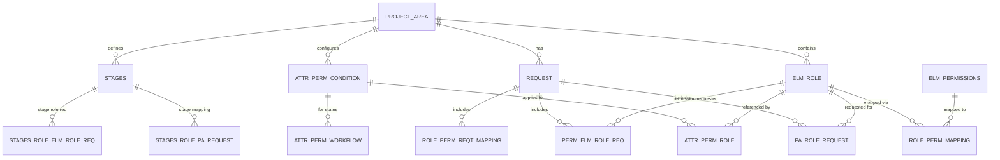

# Appendix A: Detailed Information

**General Purpose:** Provide supplementary details such as API specifications, database schema, configuration examples, and reference materials.

## A.1 Complete REST API Specification

### Base URL

```
Production: https://epc.bosch.com/epc
Development: http://localhost:8080/epc
Swagger UI: {base_url}/swagger-ui.html
API Docs: {base_url}/v3/api-docs
```

### Authentication

All API endpoints (except `/api/csrf` and Swagger UI) require authentication.

**Authentication Method:** Session-based (LDAP)

**Login:**
```http
POST /login
Content-Type: application/x-www-form-urlencoded

username=john.doe@bosch.com&password=***
```

**Logout:**
```http
POST /logout
```

### API Endpoints Summary **(Project-Sourced from controllers)**

#### ELM Role Management

| Method | Endpoint | Description | Auth Required |
|--------|----------|-------------|---------------|
| GET | `/api/roles/getAllRoles` | Get all roles | Yes |
| GET | `/api/roles/getRole/{id}` | Get role by ID | Yes |
| GET | `/api/roles/getRolesByProjectArea` | Get roles by project area | Yes |
| POST | `/api/roles/createRole` | Create new role | ADMIN, POWER_USER |
| PUT | `/api/roles/updateRole/{id}` | Update existing role | ADMIN, POWER_USER |
| DELETE | `/api/roles/deleteRole/{id}` | Delete role | ADMIN |

#### ELM Permission Management

| Method | Endpoint | Description | Auth Required |
|--------|----------|-------------|---------------|
| GET | `/api/permissions/getAllPermissions` | Get all permissions | Yes |
| GET | `/api/permissions/getPermission/{id}` | Get permission by ID | Yes |
| GET | `/api/permissions/getPermissionsByCategory` | Get permissions by category | Yes |
| POST | `/api/permissions/createPermission` | Create new permission | ADMIN |
| PUT | `/api/permissions/updatePermission/{id}` | Update permission | ADMIN |
| DELETE | `/api/permissions/deletePermission/{id}` | Delete permission | ADMIN |

#### Attribute Permission Management

| Method | Endpoint | Description | Auth Required |
|--------|----------|-------------|---------------|
| GET | `/api/attrperm/getAttrPermConditions` | Get attribute conditions by project area | Yes |
| GET | `/api/attrperm/getAttrPermCondition/{id}` | Get specific condition | Yes |
| POST | `/api/attrperm/saveAttrPermCondition` | Create attribute permission | ADMIN, POWER_USER |
| PUT | `/api/attrperm/updateAttrPermCondition/{id}` | Update attribute permission | ADMIN, POWER_USER |
| DELETE | `/api/attrperm/deleteAttrPermCondition/{id}` | Delete attribute permission | ADMIN, POWER_USER |
| POST | `/api/attrperm/bulkSaveAttrPermConditions` | Bulk create attribute permissions | ADMIN, POWER_USER |
| GET | `/api/attrperm/getAttrPermRoles` | Get roles for attribute condition | Yes |
| GET | `/api/attrperm/getAttrPermWorkflows` | Get workflows for attribute condition | Yes |
| GET | `/api/attrperm/getAttributesByWorkItemType` | Get attributes for work item type | Yes |

#### Request Management

| Method | Endpoint | Description | Auth Required |
|--------|----------|-------------|---------------|
| GET | `/api/request/getAllRequests` | Get all requests | Yes |
| GET | `/api/request/getRequest/{id}` | Get request by ID | Yes |
| GET | `/api/request/getRequestsByStatus` | Get requests by status | Yes |
| POST | `/api/request/createRequest` | Create new request | ADMIN, POWER_USER |
| POST | `/api/request/submitForApproval/{id}` | Submit request for approval | ADMIN, POWER_USER |
| PUT | `/api/request/updateRequest/{id}` | Update request (DRAFT only) | ADMIN, POWER_USER |
| DELETE | `/api/request/cancelRequest/{id}` | Cancel request | ADMIN, POWER_USER |
| GET | `/api/request/getRequestStatus/{id}` | Get request status | Yes |

#### Project Area Management

| Method | Endpoint | Description | Auth Required |
|--------|----------|-------------|---------------|
| GET | `/api/projectarea/getProjectAreas` | Get all project areas | Yes |
| GET | `/api/projectarea/getProjectArea/{id}` | Get project area by ID | Yes |
| POST | `/api/projectarea/syncProjectAreas` | Trigger project area sync | ADMIN |
| GET | `/api/projectarea/checkUserAccess` | Check user access to project area | Yes |

#### Role-Permission Mapping

| Method | Endpoint | Description | Auth Required |
|--------|----------|-------------|---------------|
| GET | `/api/roleperm/getMappings` | Get all role-permission mappings | Yes |
| GET | `/api/roleperm/getMappingsByRole/{roleId}` | Get mappings for specific role | Yes |
| POST | `/api/roleperm/createMapping` | Create role-permission mapping | ADMIN, POWER_USER |
| DELETE | `/api/roleperm/deleteMapping/{id}` | Delete mapping | ADMIN, POWER_USER |

#### Stages Management

| Method | Endpoint | Description | Auth Required |
|--------|----------|-------------|---------------|
| GET | `/api/stages/getAllStages` | Get all stages | Yes |
| GET | `/api/stages/getStagesByProjectArea` | Get stages by project area | Yes |
| POST | `/api/stages/mapStageToRoles` | Map stage to roles | ADMIN, POWER_USER |
| GET | `/api/stages/getStageMappings` | Get stage-role mappings | Yes |

#### User Management

| Method | Endpoint | Description | Auth Required |
|--------|----------|-------------|---------------|
| GET | `/api/user/getCurrentUser` | Get current logged-in user | Yes |
| GET | `/api/user/getUserRoles` | Get roles of current user | Yes |
| GET | `/api/user/searchUsers` | Search users in LDAP | ADMIN |

#### Job Management

| Method | Endpoint | Description | Auth Required |
|--------|----------|-------------|---------------|
| POST | `/api/jobs/triggerSyncJob` | Manually trigger ELM sync job | ADMIN |
| POST | `/api/jobs/triggerProcessJob` | Manually trigger request processing | ADMIN |
| GET | `/api/jobs/getJobStatus` | Get status of scheduled jobs | ADMIN |

#### CSRF Token

| Method | Endpoint | Description | Auth Required |
|--------|----------|-------------|---------------|
| GET | `/api/csrf` | Get CSRF token | No |

### API Request/Response Examples

#### Example 1: Create Role

**Request:**
```http
POST /api/roles/createRole
Content-Type: application/json
X-XSRF-TOKEN: {csrf_token}

{
    "roleName": "Senior Developer",
    "description": "Experienced developers with elevated permissions",
    "projectAreaName": "ProjectA",
    "permissionIds": [1, 2, 5, 10, 15]
}
```

**Response (201 Created):**
```json
{
    "id": 123,
    "roleName": "Senior Developer",
    "description": "Experienced developers with elevated permissions",
    "isBuiltIn": false,
    "projectArea": {
        "id": 1,
        "name": "ProjectA",
        "elmUrl": "https://elm.bosch.com/ccm/ProjectA"
    },
    "permissionMappings": [
        {
            "id": 501,
            "permission": {
                "id": 1,
                "permissionName": "Modify Work Items"
            }
        },
        {
            "id": 502,
            "permission": {
                "id": 2,
                "permissionName": "Save Process"
            }
        }
    ],
    "createdDate": "2023-12-15T10:30:00Z"
}
```

#### Example 2: Bulk Save Attribute Permissions

**Request:**
```http
POST /api/attrperm/bulkSaveAttrPermConditions
Content-Type: application/json
X-XSRF-TOKEN: {csrf_token}

{
    "projectAreaName": "ProjectB",
    "permissions": [
        {
            "attributeName": "Priority",
            "workItemType": "Defect",
            "readPerm": true,
            "writePerm": false,
            "requiredPerm": true,
            "roleIds": [1, 2],
            "workflowStateIds": [10, 11, 12]
        },
        {
            "attributeName": "Severity",
            "workItemType": "Defect",
            "readPerm": true,
            "writePerm": true,
            "requiredPerm": false,
            "roleIds": [1, 2, 3],
            "workflowStateIds": [10]
        }
    ]
}
```

**Response (201 Created):**
```json
{
    "successCount": 2,
    "failedCount": 0,
    "message": "All permissions created successfully",
    "createdIds": [201, 202],
    "errors": []
}
```

#### Example 3: Submit Request for Approval

**Request:**
```http
POST /api/request/submitForApproval/456
X-XSRF-TOKEN: {csrf_token}
```

**Response (200 OK):**
```json
{
    "id": 456,
    "requestType": "ROLE_CONFIGURATION",
    "status": "PENDING",
    "requestor": "john.doe@bosch.com",
    "workOnRequestId": "WO-2023-5678",
    "projectArea": {
        "id": 1,
        "name": "ProjectA"
    },
    "createdDate": "2023-12-15T09:00:00Z",
    "submittedDate": "2023-12-15T10:30:00Z",
    "approvedDate": null,
    "completedDate": null
}
```

## A.2 Complete Database Schema

### Entity Relationship Diagram



### Complete Table Definitions

#### Core Tables

**project_area** **(Project-Sourced)**
```sql
CREATE TABLE project_area (
    id BIGINT AUTO_INCREMENT PRIMARY KEY,
    name VARCHAR(255) NOT NULL UNIQUE,
    elm_url VARCHAR(500) NOT NULL,
    active BOOLEAN DEFAULT TRUE,
    description TEXT,
    sync_date TIMESTAMP NULL,
    created_date TIMESTAMP DEFAULT CURRENT_TIMESTAMP,
    updated_date TIMESTAMP DEFAULT CURRENT_TIMESTAMP ON UPDATE CURRENT_TIMESTAMP,
    INDEX idx_active (active),
    INDEX idx_name (name)
);
```

**elm_role** **(Project-Sourced)**
```sql
CREATE TABLE elm_role (
    id BIGINT AUTO_INCREMENT PRIMARY KEY,
    role_name VARCHAR(255) NOT NULL,
    description TEXT,
    is_built_in BOOLEAN DEFAULT FALSE,
    project_area_id BIGINT NOT NULL,
    created_date TIMESTAMP DEFAULT CURRENT_TIMESTAMP,
    updated_date TIMESTAMP DEFAULT CURRENT_TIMESTAMP ON UPDATE CURRENT_TIMESTAMP,
    created_by VARCHAR(255),
    FOREIGN KEY (project_area_id) REFERENCES project_area(id) ON DELETE CASCADE,
    UNIQUE KEY unique_role_per_project (role_name, project_area_id),
    INDEX idx_project_area (project_area_id),
    INDEX idx_role_name (role_name)
);
```

**elm_permissions** **(Project-Sourced)**
```sql
CREATE TABLE elm_permissions (
    id BIGINT AUTO_INCREMENT PRIMARY KEY,
    permission_name VARCHAR(255) NOT NULL UNIQUE,
    category VARCHAR(50) NOT NULL,
    operation_type VARCHAR(100),
    description TEXT,
    created_date TIMESTAMP DEFAULT CURRENT_TIMESTAMP,
    INDEX idx_category (category)
);
```

**role_perm_mapping** **(Project-Sourced)**
```sql
CREATE TABLE role_perm_mapping (
    id BIGINT AUTO_INCREMENT PRIMARY KEY,
    role_id BIGINT NOT NULL,
    permission_id BIGINT NOT NULL,
    created_date TIMESTAMP DEFAULT CURRENT_TIMESTAMP,
    created_by VARCHAR(255),
    FOREIGN KEY (role_id) REFERENCES elm_role(id) ON DELETE CASCADE,
    FOREIGN KEY (permission_id) REFERENCES elm_permissions(id) ON DELETE CASCADE,
    UNIQUE KEY unique_role_perm (role_id, permission_id),
    INDEX idx_role (role_id),
    INDEX idx_permission (permission_id)
);
```

**attr_perm_condition** **(Project-Sourced)**
```sql
CREATE TABLE attr_perm_condition (
    id BIGINT AUTO_INCREMENT PRIMARY KEY,
    attribute_name VARCHAR(255) NOT NULL,
    work_item_type VARCHAR(100) NOT NULL,
    read_perm BOOLEAN DEFAULT FALSE,
    write_perm BOOLEAN DEFAULT FALSE,
    required_perm BOOLEAN DEFAULT FALSE,
    project_area_id BIGINT NOT NULL,
    created_date TIMESTAMP DEFAULT CURRENT_TIMESTAMP,
    updated_date TIMESTAMP DEFAULT CURRENT_TIMESTAMP ON UPDATE CURRENT_TIMESTAMP,
    created_by VARCHAR(255),
    FOREIGN KEY (project_area_id) REFERENCES project_area(id) ON DELETE CASCADE,
    INDEX idx_project_area (project_area_id),
    INDEX idx_attribute (attribute_name),
    INDEX idx_work_item_type (work_item_type)
);
```

**attr_perm_role** **(Project-Sourced)**
```sql
CREATE TABLE attr_perm_role (
    id BIGINT AUTO_INCREMENT PRIMARY KEY,
    attr_perm_condition_id BIGINT NOT NULL,
    role_id BIGINT NOT NULL,
    created_date TIMESTAMP DEFAULT CURRENT_TIMESTAMP,
    FOREIGN KEY (attr_perm_condition_id) REFERENCES attr_perm_condition(id) ON DELETE CASCADE,
    FOREIGN KEY (role_id) REFERENCES elm_role(id) ON DELETE CASCADE,
    UNIQUE KEY unique_condition_role (attr_perm_condition_id, role_id),
    INDEX idx_condition (attr_perm_condition_id),
    INDEX idx_role (role_id)
);
```

**attr_perm_workflow** **(Project-Sourced)**
```sql
CREATE TABLE attr_perm_workflow (
    id BIGINT AUTO_INCREMENT PRIMARY KEY,
    attr_perm_condition_id BIGINT NOT NULL,
    workflow_state_id BIGINT NOT NULL,
    created_date TIMESTAMP DEFAULT CURRENT_TIMESTAMP,
    FOREIGN KEY (attr_perm_condition_id) REFERENCES attr_perm_condition(id) ON DELETE CASCADE,
    UNIQUE KEY unique_condition_workflow (attr_perm_condition_id, workflow_state_id),
    INDEX idx_condition (attr_perm_condition_id),
    INDEX idx_workflow (workflow_state_id)
);
```

**request** **(Project-Sourced)**
```sql
CREATE TABLE request (
    id BIGINT AUTO_INCREMENT PRIMARY KEY,
    request_type VARCHAR(50) NOT NULL,
    status VARCHAR(20) NOT NULL,
    requestor VARCHAR(255) NOT NULL,
    work_on_request_id VARCHAR(100),
    project_area_id BIGINT,
    description TEXT,
    rejection_reason TEXT,
    created_date TIMESTAMP DEFAULT CURRENT_TIMESTAMP,
    submitted_date TIMESTAMP NULL,
    approved_date TIMESTAMP NULL,
    completed_date TIMESTAMP NULL,
    FOREIGN KEY (project_area_id) REFERENCES project_area(id),
    INDEX idx_status (status),
    INDEX idx_requestor (requestor),
    INDEX idx_workon (work_on_request_id),
    INDEX idx_created_date (created_date)
);
```

**stages** **(Project-Sourced)**
```sql
CREATE TABLE stages (
    id BIGINT AUTO_INCREMENT PRIMARY KEY,
    stage_name VARCHAR(100) NOT NULL,
    stage_order INT NOT NULL,
    project_area_id BIGINT NOT NULL,
    description TEXT,
    created_date TIMESTAMP DEFAULT CURRENT_TIMESTAMP,
    FOREIGN KEY (project_area_id) REFERENCES project_area(id) ON DELETE CASCADE,
    UNIQUE KEY unique_stage_per_project (stage_name, project_area_id),
    INDEX idx_project_area (project_area_id),
    INDEX idx_order (stage_order)
);
```

### Reference Data Tables

**workflow_state**
```sql
CREATE TABLE workflow_state (
    id BIGINT AUTO_INCREMENT PRIMARY KEY,
    state_name VARCHAR(100) NOT NULL,
    state_group VARCHAR(50) NOT NULL,
    work_item_type VARCHAR(100) NOT NULL,
    project_area_id BIGINT NOT NULL,
    FOREIGN KEY (project_area_id) REFERENCES project_area(id) ON DELETE CASCADE,
    UNIQUE KEY unique_state (state_name, work_item_type, project_area_id),
    INDEX idx_work_item_type (work_item_type),
    INDEX idx_project_area (project_area_id)
);
```

**work_item_type**
```sql
CREATE TABLE work_item_type (
    id BIGINT AUTO_INCREMENT PRIMARY KEY,
    type_name VARCHAR(100) NOT NULL,
    type_id VARCHAR(255) NOT NULL,
    project_area_id BIGINT NOT NULL,
    FOREIGN KEY (project_area_id) REFERENCES project_area(id) ON DELETE CASCADE,
    UNIQUE KEY unique_type_per_project (type_name, project_area_id),
    INDEX idx_project_area (project_area_id)
);
```

**attribute_built_in** **(Project-Sourced)**
```sql
CREATE TABLE attribute_built_in (
    id BIGINT AUTO_INCREMENT PRIMARY KEY,
    attribute_id VARCHAR(255) NOT NULL,
    attribute_name VARCHAR(255) NOT NULL,
    attribute_type VARCHAR(50) NOT NULL,
    is_built_in BOOLEAN DEFAULT TRUE,
    work_item_type VARCHAR(100),
    project_area_id BIGINT NOT NULL,
    FOREIGN KEY (project_area_id) REFERENCES project_area(id) ON DELETE CASCADE,
    INDEX idx_project_area (project_area_id),
    INDEX idx_work_item_type (work_item_type)
);
```

### Audit Tables

**audit_log**
```sql
CREATE TABLE audit_log (
    id BIGINT AUTO_INCREMENT PRIMARY KEY,
    timestamp TIMESTAMP DEFAULT CURRENT_TIMESTAMP,
    user_id VARCHAR(255) NOT NULL,
    action VARCHAR(100) NOT NULL,
    resource_type VARCHAR(100),
    resource_id BIGINT,
    details TEXT,
    ip_address VARCHAR(45),
    status VARCHAR(20),
    INDEX idx_timestamp (timestamp),
    INDEX idx_user (user_id),
    INDEX idx_action (action),
    INDEX idx_resource (resource_type, resource_id)
);
```

## A.3 Configuration Examples

### application.properties (Development)

```properties
# Server Configuration
server.port=8080
server.servlet.context-path=/epc
server.compression.enabled=true

# Database Configuration
spring.datasource.url=jdbc:mysql://localhost:3306/epc_dev
spring.datasource.username=epc_user
spring.datasource.password=${DB_PASSWORD}
spring.datasource.driver-class-name=com.mysql.cj.jdbc.Driver
spring.datasource.hikari.maximum-pool-size=10
spring.datasource.hikari.minimum-idle=5
spring.datasource.hikari.connection-timeout=30000

# JPA/Hibernate Configuration
spring.jpa.hibernate.ddl-auto=update
spring.jpa.show-sql=false
spring.jpa.properties.hibernate.dialect=org.hibernate.dialect.MySQL8Dialect
spring.jpa.properties.hibernate.format_sql=true
spring.jpa.properties.hibernate.use_sql_comments=true
spring.jpa.properties.hibernate.jdbc.batch_size=50
spring.jpa.properties.hibernate.order_inserts=true
spring.jpa.properties.hibernate.order_updates=true

# Hibernate Cache Configuration
spring.jpa.properties.hibernate.cache.use_second_level_cache=true
spring.jpa.properties.hibernate.cache.use_query_cache=true
spring.jpa.properties.hibernate.cache.region.factory_class=org.hibernate.cache.jcache.JCacheCacheRegionFactory
spring.jpa.properties.hibernate.javax.cache.provider=org.ehcache.jsr107.EhcacheCachingProvider
spring.jpa.properties.hibernate.javax.cache.uri=classpath:ehcache.xml

# Logging Configuration
logging.level.root=INFO
logging.level.com.bosch.epc=DEBUG
logging.level.org.springframework.web=INFO
logging.level.org.hibernate.SQL=DEBUG
logging.level.org.hibernate.type.descriptor.sql.BasicBinder=TRACE
logging.file.name=/var/log/epc/application.log
logging.file.max-size=10MB
logging.file.max-history=30

# Spring Security
spring.security.user.name=admin
spring.security.user.password=admin123

# LDAP Configuration (Development - adjust for production)
spring.ldap.urls=ldap://localhost:10389
spring.ldap.base=dc=bosch,dc=com
spring.ldap.username=cn=admin,dc=bosch,dc=com
spring.ldap.password=${LDAP_PASSWORD}

# ELM Server Configuration
elm.base.url=https://elm-dev.bosch.com/ccm
elm.username=${ELM_USERNAME}
elm.password=${ELM_PASSWORD}
elm.connection.timeout=30000
elm.read.timeout=60000

# WorkON Configuration
workon.api.url=https://workon-dev.bosch.com/api
workon.api.key=${WORKON_API_KEY}

# Job Scheduling
jobs.elm.sync.cron=0 0 2 * * *
jobs.request.process.cron=0 */15 * * * *
jobs.workon.status.sync.cron=0 */15 * * * *

# Actuator Configuration
management.endpoints.web.exposure.include=health,info,metrics,prometheus
management.endpoint.health.show-details=when-authorized
management.metrics.enable.jvm=true
management.metrics.enable.system=true

# Swagger/OpenAPI Configuration
springdoc.api-docs.path=/v3/api-docs
springdoc.swagger-ui.path=/swagger-ui.html
springdoc.swagger-ui.operationsSorter=method
springdoc.swagger-ui.tagsSorter=alpha
```

### application.properties (Production)

```properties
# Server Configuration
server.port=8080
server.servlet.context-path=/epc
server.compression.enabled=true

# Database Configuration
spring.datasource.url=jdbc:mysql://bp0vm025.emea.bosch.com:3306/epc
spring.datasource.username=tooldatabase
spring.datasource.password=${DB_PASSWORD}
spring.datasource.driver-class-name=com.mysql.cj.jdbc.Driver
spring.datasource.hikari.maximum-pool-size=20
spring.datasource.hikari.minimum-idle=10
spring.datasource.hikari.connection-timeout=30000

# JPA/Hibernate Configuration
spring.jpa.hibernate.ddl-auto=none
spring.jpa.show-sql=false
spring.jpa.properties.hibernate.dialect=org.hibernate.dialect.MySQL8Dialect
spring.jpa.properties.hibernate.jdbc.batch_size=50

# Hibernate Cache Configuration
spring.jpa.properties.hibernate.cache.use_second_level_cache=true
spring.jpa.properties.hibernate.cache.use_query_cache=true
spring.jpa.properties.hibernate.cache.region.factory_class=org.hibernate.cache.jcache.JCacheCacheRegionFactory
spring.jpa.properties.hibernate.javax.cache.provider=org.ehcache.jsr107.EhcacheCachingProvider
spring.jpa.properties.hibernate.javax.cache.uri=classpath:ehcache.xml

# Logging Configuration
logging.level.root=WARN
logging.level.com.bosch.epc=INFO
logging.level.org.springframework.web=WARN
logging.level.org.hibernate.SQL=WARN
logging.file.name=/var/log/epc/application.log
logging.file.max-size=50MB
logging.file.max-history=90

# LDAP Configuration
spring.ldap.urls=ldaps://ldap.bosch.com:636
spring.ldap.base=dc=bosch,dc=com
spring.ldap.username=${LDAP_BIND_DN}
spring.ldap.password=${LDAP_PASSWORD}

# ELM Server Configuration
elm.base.url=https://elm.bosch.com/ccm
elm.username=${ELM_USERNAME}
elm.password=${ELM_PASSWORD}
elm.connection.timeout=30000
elm.read.timeout=120000

# WorkON Configuration
workon.api.url=https://workon.bosch.com/api
workon.api.key=${WORKON_API_KEY}

# Job Scheduling
jobs.elm.sync.cron=0 0 2 * * *
jobs.request.process.cron=0 */15 * * * *
jobs.workon.status.sync.cron=0 */15 * * * *

# Actuator Configuration
management.endpoints.web.exposure.include=health,info
management.endpoint.health.show-details=never

# Swagger/OpenAPI Configuration (disabled in production)
springdoc.api-docs.enabled=false
springdoc.swagger-ui.enabled=false
```

### ehcache.xml Configuration **(Project-Sourced)**

```xml
<config xmlns='http://www.ehcache.org/v3'
        xmlns:jsr107='http://www.ehcache.org/v3/jsr107'>
    
    <service>
        <jsr107:defaults enable-management="true" enable-statistics="true"/>
    </service>
    
    <!-- Project Area Cache -->
    <cache alias="com.bosch.epc.datamodel.ProjectArea">
        <key-type>java.lang.Long</key-type>
        <value-type>com.bosch.epc.datamodel.ProjectArea</value-type>
        <expiry>
            <ttl unit="hours">1</ttl>
        </expiry>
        <resources>
            <heap unit="entries">1000</heap>
        </resources>
    </cache>
    
    <!-- ELM Role Cache -->
    <cache alias="com.bosch.epc.datamodel.ELMRole">
        <key-type>java.lang.Long</key-type>
        <value-type>com.bosch.epc.datamodel.ELMRole</value-type>
        <expiry>
            <ttl unit="hours">1</ttl>
        </expiry>
        <resources>
            <heap unit="entries">2000</heap>
        </resources>
    </cache>
    
    <!-- ELM Permissions Cache -->
    <cache alias="com.bosch.epc.datamodel.ELMPermissions">
        <key-type>java.lang.Long</key-type>
        <value-type>com.bosch.epc.datamodel.ELMPermissions</value-type>
        <expiry>
            <ttl unit="hours">2</ttl>
        </expiry>
        <resources>
            <heap unit="entries">500</heap>
        </resources>
    </cache>
    
    <!-- Query Cache -->
    <cache alias="org.hibernate.cache.internal.StandardQueryCache">
        <key-type>java.lang.Object</key-type>
        <value-type>java.lang.Object</value-type>
        <expiry>
            <ttl unit="minutes">30</ttl>
        </expiry>
        <resources>
            <heap unit="entries">500</heap>
        </resources>
    </cache>
    
    <!-- Update Timestamps Cache -->
    <cache alias="org.hibernate.cache.spi.UpdateTimestampsCache">
        <key-type>java.lang.Object</key-type>
        <value-type>java.lang.Object</value-type>
        <resources>
            <heap unit="entries">5000</heap>
        </resources>
    </cache>
    
</config>
```

## A.4 Sample XML Configuration Output

### Role Definition XML

```xml
<?xml version="1.0" encoding="UTF-8"?>
<process:role-definitions xmlns:process="http://www.ibm.com/xmlns/prod/jazz/process/1.0/">
    
    <role id="developer" name="Developer">
        <description>Development team member with code modification rights</description>
        <icon>platform:/plugin/com.ibm.team.process/icons/user.gif</icon>
    </role>
    
    <role id="senior_developer" name="Senior Developer">
        <description>Senior developers with elevated permissions</description>
        <icon>platform:/plugin/com.ibm.team.process/icons/user.gif</icon>
    </role>
    
    <role id="tester" name="Tester">
        <description>QA team member with testing rights</description>
        <icon>platform:/plugin/com.ibm.team.process/icons/user.gif</icon>
    </role>
    
</process:role-definitions>
```

### Permission Definition XML

```xml
<?xml version="1.0" encoding="UTF-8"?>
<process:permissions xmlns:process="http://www.ibm.com/xmlns/prod/jazz/process/1.0/">
    
    <!-- Team Operations -->
    <team-operation id="modify_work_items">
        <operation-id>com.ibm.team.workitem.operation.workItemModify</operation-id>
        <role id="developer"/>
        <role id="senior_developer"/>
    </team-operation>
    
    <team-operation id="save_work_items">
        <operation-id>com.ibm.team.workitem.operation.workItemSave</operation-id>
        <role id="developer"/>
        <role id="senior_developer"/>
        <role id="tester"/>
    </team-operation>
    
    <!-- Project Operations -->
    <project-operation id="scm_access">
        <operation-id>com.ibm.team.scm.common.permission.workspace</operation-id>
        <role id="developer"/>
        <role id="senior_developer"/>
    </project-operation>
    
</process:permissions>
```

### Attribute Permission XML

```xml
<?xml version="1.0" encoding="UTF-8"?>
<process:attribute-permissions xmlns:process="http://www.ibm.com/xmlns/prod/jazz/process/1.0/">
    
    <!-- Priority attribute for Defect work item type -->
    <attribute id="priority" for-type="defect">
        <condition>
            <role id="developer"/>
            <role id="senior_developer"/>
            <workflow-state id="com.example.state.inprogress"/>
            <workflow-state id="com.example.state.review"/>
        </condition>
        <actions>
            <action>READ</action>
            <action>MODIFY</action>
        </actions>
        <required>true</required>
    </attribute>
    
    <!-- Severity attribute -->
    <attribute id="severity" for-type="defect">
        <condition>
            <role id="developer"/>
            <role id="senior_developer"/>
            <role id="tester"/>
            <workflow-state id="com.example.state.new"/>
        </condition>
        <actions>
            <action>READ</action>
            <action>MODIFY</action>
        </actions>
        <required>false</required>
    </attribute>
    
</process:attribute-permissions>
```

## A.5 Useful Commands and Scripts

### Build and Deploy

```bash
# Build with Maven
mvn clean install

# Build without tests
mvn clean install -DskipTests

# Run specific tests
mvn test -Dtest=ELMRoleServiceTest

# Package as WAR
mvn package

# Deploy to Tomcat (Linux)
sudo cp target/epc.war /opt/tomcat/webapps/
sudo systemctl restart tomcat

# View logs
tail -f /var/log/epc/application.log
```

### Database Operations

```sql
-- Count records in key tables
SELECT 'project_area' AS table_name, COUNT(*) AS count FROM project_area
UNION ALL
SELECT 'elm_role', COUNT(*) FROM elm_role
UNION ALL
SELECT 'elm_permissions', COUNT(*) FROM elm_permissions
UNION ALL
SELECT 'role_perm_mapping', COUNT(*) FROM role_perm_mapping
UNION ALL
SELECT 'attr_perm_condition', COUNT(*) FROM attr_perm_condition
UNION ALL
SELECT 'request', COUNT(*) FROM request;

-- View request statistics
SELECT status, COUNT(*) AS count 
FROM request 
GROUP BY status;

-- Find roles for a project area
SELECT r.role_name, r.description, r.is_built_in
FROM elm_role r
JOIN project_area pa ON r.project_area_id = pa.id
WHERE pa.name = 'ProjectA';

-- Find permissions for a role
SELECT p.permission_name, p.category
FROM elm_permissions p
JOIN role_perm_mapping rpm ON p.id = rpm.permission_id
JOIN elm_role r ON rpm.role_id = r.id
WHERE r.role_name = 'Developer';

-- Check cache statistics (requires Hibernate statistics enabled)
SELECT * FROM INFORMATION_SCHEMA.CACHES;
```

### Monitoring and Troubleshooting

```bash
# Check application health
curl http://localhost:8080/epc/actuator/health

# Get application metrics
curl http://localhost:8080/epc/actuator/metrics

# Check JVM memory usage
curl http://localhost:8080/epc/actuator/metrics/jvm.memory.used

# Check database connections
curl http://localhost:8080/epc/actuator/metrics/hikaricp.connections.active

# View thread dump (requires admin auth)
curl http://localhost:8080/epc/actuator/threaddump

# Heap dump (warning: can be large!)
curl http://localhost:8080/epc/actuator/heapdump -O

# Trigger manual ELM sync (requires ADMIN role)
curl -X POST http://localhost:8080/epc/api/jobs/triggerSyncJob \
     -H "X-XSRF-TOKEN: {token}" \
     --cookie "JSESSIONID={session}"
```

## A.6 References and Resources

### Official Documentation

- **Spring Boot Documentation:** https://spring.io/projects/spring-boot
- **Spring Data JPA:** https://spring.io/projects/spring-data-jpa
- **Spring Security:** https://spring.io/projects/spring-security
- **Hibernate ORM:** https://hibernate.org/orm/documentation/
- **Ehcache:** https://www.ehcache.org/documentation/
- **MySQL Documentation:** https://dev.mysql.com/doc/
- **Swagger/OpenAPI:** https://swagger.io/docs/

### IBM ELM Resources

- **IBM Engineering Lifecycle Management:** https://www.ibm.com/products/engineering-lifecycle-management
- **ELM REST API Documentation:** **(Access restricted to Bosch users)**
- **Process Template Documentation:** **(Access restricted to Bosch users)**

### Internal Bosch Resources

- **Bosch IT Standards:** **(Internal link - provide actual link)**
- **WorkON System Documentation:** **(Internal link - provide actual link)**
- **Bosch LDAP/Active Directory:** **(Internal link - provide actual link)**

### Related Projects and Tools

- **Maven Repository (Nexus):** **(Provide Bosch Nexus URL)**
- **CI/CD Pipeline:** **(Provide Jenkins/GitLab CI URL)**
- **Source Code Repository:** **(Provide Git repository URL)**
- **Issue Tracking:** **(Provide Jira/Issue tracker URL)**

---

**Document Version:** 1.0  
**Last Updated:** December 18, 2025  
**Maintained By:** EPC Development Team  
**Contact:** **[Provide team email or contact]**
